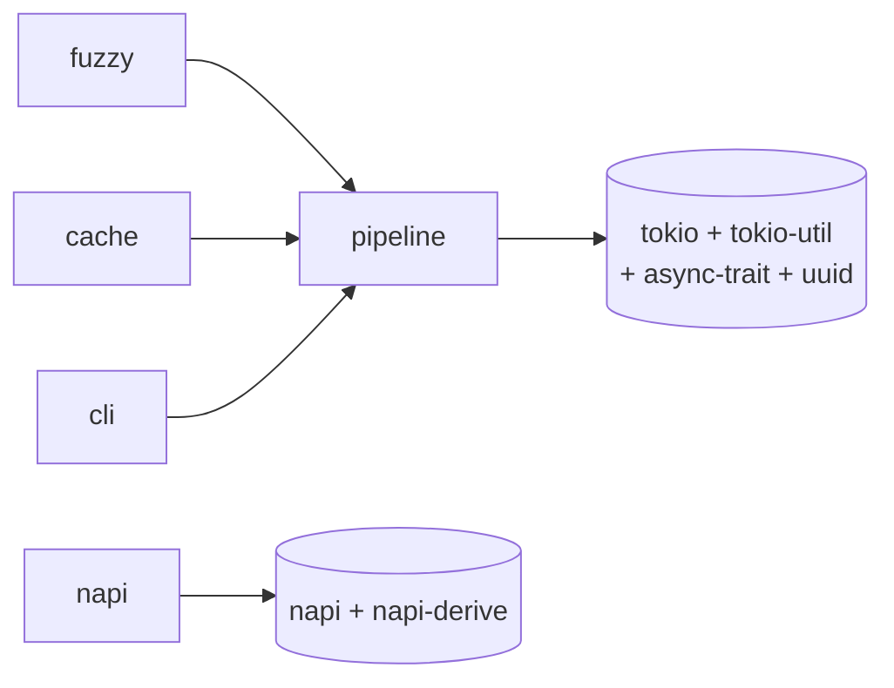

# Architecture

This is the "how it fits together today" doc. For the reasoning behind these choices,
see [`docs/superpowers/specs/2026-07-03-michi-design.md`](docs/superpowers/specs/2026-07-03-michi-design.md).
For the full module list and public API, see `README.md` and
[`docs/spec/`](docs/spec/README.md). This doc only covers structure.

## One crate, feature-gated

`michi` ships as a single crate with everything behind opt-in features rather than as
several small crates. A consumer who adds `michi` with default features gets pure
rendering and nothing else — no async runtime, no cache, no CLI deps. That guarantee is
enforced by Cargo, not by convention: each feature only exists to unlock `optional = true`
dependencies that nothing in the default build ever references.



The one thing worth internalizing from this graph: **`fuzzy`, `cache`, and `cli`
all pull in `pipeline`, and `pipeline` is what pulls in tokio.** `mcp` isn't in this
graph at all — it's an always-compiled module, not a Cargo feature; see
[`docs/spec/04-mcp-and-napi.md`](docs/spec/04-mcp-and-napi.md). Want fuzzy matching with
no async runtime? Not possible today — `Resolution<T>` is used in pipeline context, so
`fuzzy` implies `pipeline` by design. `napi` is the only feature that's a dead end on its
own — it never touches tokio.

## Two crates, one build-artifact boundary

`packages/michi-node` exists as a second Cargo crate for exactly one reason:
`crate-type = ["cdylib"]` can't coexist with a regular `[lib]` in the same `Cargo.toml`.
It is not a second layer of design — it's a thin shim.

```mermaid
flowchart LR
    subgraph michi["michi (rlib)"]
        core["always-compiled modules<br/>toon, kv, hints, error, ..."]
        napi_mod["src/napi.rs<br/>#[cfg(feature = \"napi\")]"]
    end
    subgraph node["packages/michi-node (cdylib)"]
        shim["src/lib.rs:<br/>pub use michi::napi::*;"]
    end
    napi_mod --> shim
    shim --> binary[(".node binary")]
    binary --> npm["npm package \"@orin-axi/michi\"<br/>(TypeScript consumers)"]
```

Every `#[napi]` export — the actual function bodies, the `JsToonOptions` /
`JsToonValue` types, the input-bounds validation — lives in `src/napi.rs`, inside the main
crate, where it's unit-tested like everything else. `packages/michi-node/src/lib.rs` does
nothing but `pub use michi::napi::*;`. **If you're adding a NAPI export, it goes in
`src/napi.rs`, not in `packages/michi-node`.** The re-export still works because
napi-derive's registration is linker-section based (`ctor`), not call-site based — it
survives crossing a crate boundary via `pub use`. This is verified by an actual `.node`
build + the JS test suite in CI, not just `cargo build`.

## Always-compiled vs. feature-gated, inside one module

The pattern used throughout: pure, sync computation is always compiled; the async
extension of the same concept sits behind a feature, in the same directory.

```
resilience/
  mod.rs      next_retry_delay(), parse_retry_after()   ← always compiled
  policy.rs   with_resilience()                          ← #[cfg(feature = "pipeline")]
  circuit.rs  CircuitBreaker, CircuitState                ← #[cfg(feature = "pipeline")]

pipeline/
  mod.rs      Pipeline (pure data) + render()             ← always compiled
  executor.rs PipelineExecutor, PipelineContext            ← #[cfg(feature = "pipeline")]
```

`pipeline::Pipeline` is deliberately always compiled: a caller should be able to render a
pipeline's current state without pulling in an executor to run one. The same split applies
to `resilience` (you can compute a retry delay without tokio) and will apply to `sink` once
Plan 2 fills it in.

## Boundaries worth knowing before you touch them

- **`src/napi.rs` is the one place `unsafe` is permitted** (`#![deny(unsafe_code)]` at the
  crate root, with a scoped `#![allow(unsafe_code)]` inside `napi.rs` for napi-derive's
  generated FFI glue — `deny`, not `forbid`, specifically so that override is possible).
- **Untrusted input crosses exactly one boundary**: JS callers, via NAPI. Every export
  there validates collection sizes before doing work and is wrapped in
  `#[napi(catch_unwind)]`. Nowhere else in the crate needs to think about adversarial
  input — callers elsewhere are trusted Rust code.
- **[`docs/spec/02-toon-format.md`](docs/spec/02-toon-format.md)'s grammar is the contract.**
  If you change what `escape_value` or `render_toon` produce, update the spec in the same
  PR — they're supposed to describe the same thing.
