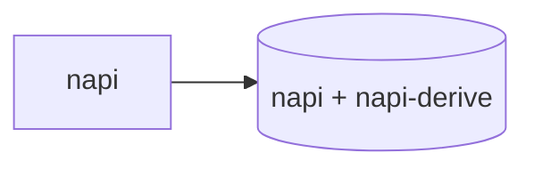

# Architecture

This is the "how it fits together today" doc. For the reasoning behind these choices,
see [`docs/superpowers/specs/2026-07-03-michi-design.md`](docs/superpowers/specs/2026-07-03-michi-design.md).
For the full module list and public API, see `README.md` and
[`docs/spec/`](docs/spec/README.md). This doc only covers structure.

## One crate today, more crates as Plan 2 gets built

`michi` today is one crate (plus the `packages/michi-node` NAPI shim, split out only because
`crate-type = ["cdylib"]` can't coexist with a regular `[lib]` in the same `Cargo.toml`). Default
features get pure rendering and nothing else — no async runtime, no cache, no CLI deps. `napi`
and `serde` are the only two optional features, and both stay features rather than becoming their
own crates: `serde`'s derives are low-consequence even if Cargo's feature-unification pulls them
into a build that didn't ask for them (most Rust consumers already have `serde` somewhere), and
`napi` requires napi-rs's cdylib build model, which doesn't practically leak into a normal Rust
binary's dependency graph the way an async runtime would.



**Plan 2 (`pipeline`/`fuzzy`/`cache`/`cli`) does not exist as code or as Cargo features today.**
It was removed from this crate's feature graph deliberately — see
[`docs/spec/06-decisions.md`](docs/spec/06-decisions.md)'s crate-boundary entry for the full
reasoning. The short version: those pieces pull in dependencies heavy and opinionated enough
(tokio, moka, nucleo-matcher, a terminal stack) that Cargo's feature-unification model would risk
surprising a consumer of the zero-dep default build who never asked for them — a risk that a
Cargo *feature* on this crate can't fully close, but a separate *crate* can, since a binary that
doesn't depend on that crate never pulls its dependencies in at all, regardless of what anything
else in its graph does. When each piece is actually built, it lands as its own crate depending on
`michi`, not a feature flag on `michi` itself — `pipeline` first (the others each depend on it),
`resilience`'s async circuit-breaker/retry-wrapper folded into that same crate rather than split
further (they have no use case independent of wrapping pipeline step execution), then `fuzzy`,
`cache`, and `cli` each as their own crate once their turn comes.

## Two crates, one build-artifact boundary

`packages/michi-node` exists as a second Cargo crate for exactly one reason:
`crate-type = ["cdylib"]` can't coexist with a regular `[lib]` in the same `Cargo.toml`.
It is not a second layer of design — it's a thin shim.

```mermaid
flowchart LR
    subgraph michi["michi (rlib)"]
        core["always-compiled modules<br/>toon, kv, hints, error, ..."]
        napi_mod["src/napi.rs<br/>#[cfg(feature = \"napi\")]"]
    end
    subgraph node["packages/michi-node (cdylib)"]
        shim["src/lib.rs:<br/>pub use michi::napi::*;"]
    end
    napi_mod --> shim
    shim --> binary[(".node binary")]
    binary --> npm["npm package \"@orin-axi/michi\"<br/>(TypeScript consumers)"]
```

Every `#[napi]` export — the actual function bodies, the `JsToonOptions` /
`JsToonValue` types, the input-bounds validation — lives in `src/napi.rs`, inside the main
crate, where it's unit-tested like everything else. `packages/michi-node/src/lib.rs` does
nothing but `pub use michi::napi::*;`. **If you're adding a NAPI export, it goes in
`src/napi.rs`, not in `packages/michi-node`.** The re-export still works because
napi-derive's registration is linker-section based (`ctor`), not call-site based — it
survives crossing a crate boundary via `pub use`. This is verified by an actual `.node`
build + the JS test suite in CI, not just `cargo build`.

## Always-compiled vs. feature-gated, inside one module

The pattern used throughout: pure, sync computation is always compiled; the async
extension of the same concept sits behind a feature, in the same directory.

```
resilience/
  mod.rs      next_retry_delay(), parse_retry_after()   ← always compiled
  policy.rs   with_resilience()                          ← #[cfg(feature = "pipeline")]
  circuit.rs  CircuitBreaker, CircuitState                ← #[cfg(feature = "pipeline")]

pipeline/
  mod.rs      Pipeline (pure data) + render()             ← always compiled
  executor.rs PipelineExecutor, PipelineContext            ← #[cfg(feature = "pipeline")]
```

`pipeline::Pipeline` is deliberately always compiled: a caller should be able to render a
pipeline's current state without pulling in an executor to run one. The same split applies
to `resilience` (you can compute a retry delay without tokio) and will apply to `sink` once
Plan 2 fills it in.

## Boundaries worth knowing before you touch them

- **`src/napi.rs` is the one place `unsafe` is permitted** (`#![deny(unsafe_code)]` at the
  crate root, with a scoped `#![allow(unsafe_code)]` inside `napi.rs` for napi-derive's
  generated FFI glue — `deny`, not `forbid`, specifically so that override is possible).
- **Untrusted input crosses exactly one boundary**: JS callers, via NAPI. Every export
  there validates collection sizes before doing work and is wrapped in
  `#[napi(catch_unwind)]`. Nowhere else in the crate needs to think about adversarial
  input — callers elsewhere are trusted Rust code.
- **[`docs/spec/02-toon-format.md`](docs/spec/02-toon-format.md)'s grammar is the contract.**
  If you change what `escape_value` or `render_toon` produce, update the spec in the same
  PR — they're supposed to describe the same thing.
