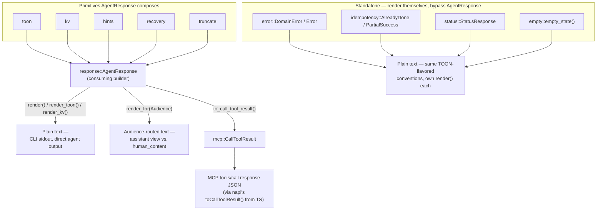
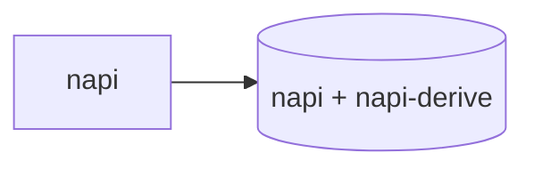
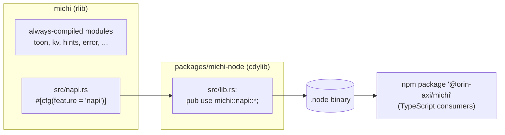

# Architecture

This is the "how it fits together today" doc. For the reasoning behind these choices, see [`docs/superpowers/specs/2026-07-03-michi-design.md`](docs/superpowers/specs/2026-07-03-michi-design.md). For the full module list and public API, see `README.md` and [`docs/spec/`](docs/spec/README.md). This doc only covers structure.

## The plan, and what's built so far

Two phases. **Plan 1** is a pure-primitives Rust crate — no protocol knowledge, no async runtime. **Plan 2** is an async execution layer that consumes Plan 1's primitives, shipped as separate crates rather than features on this one (see [Plan 2 doesn't exist yet](#plan-2-doesnt-exist-yet) below for why).

| Piece | Status | Lives in |
| --- | --- | --- |
| Rendering primitives (`toon`, `kv`, `hints`, `truncate`, `empty`, `error`, `idempotency`, `status`, `recovery`, `response`, `mcp`, `audience`, `telemetry`) | ✅ Built | this crate, always compiled |
| `resilience`'s sync helpers (`next_retry_delay()`, `parse_retry_after()`) | ✅ Built | this crate, always compiled |
| `pipeline`'s data model (`Pipeline`, `PipelineStep`, `StepStatus`, `render()`) | ✅ Built | this crate, always compiled — no executor, this only renders state |
| NAPI/npm boundary (`@orin-axi/michi`) | ✅ Built | `src/napi.rs` + `packages/michi-node`, behind the `napi` feature |
| crates.io / npm publish | ⬜ Not started | gated on a real consumer depending on michi first — see [`docs/spec/06-decisions.md`](docs/spec/06-decisions.md) |
| `pipeline` executor (actually runs steps) | ⬜ Not started | future crate, depends on `michi::pipeline::Pipeline` |
| `resilience`'s async circuit-breaker / retry-wrapper | ⬜ Not started | folds into the future `pipeline` executor crate, not its own |
| `fuzzy` | ⬜ Not started | future crate, depends on the `pipeline` crate |
| `cache` | ⬜ Not started | future crate |
| `cli` (terminal-aware rendering) | ⬜ Not started | future crate |

Nothing in the "Not started" rows exists yet, not even as a stub — see below.

## How the pieces compose

Two composition shapes, both always compiled, both zero-dep. Which one a caller reaches for depends on whether the response is a list/item with optional hints, or something with its own fixed shape (an error, a health check, an already-done signal).

**`response::AgentResponse` — the general-purpose builder.** Composes `toon`, `kv`, `hints`, `recovery`, and `truncate` into one object with one render path. This is what most callers want: a TOON list or a KV single-item, with optional `help[]` hints and recovery guidance layered on.

**Standalone renderable types — for a response with its own fixed shape.** `error::DomainError`/`Error`, `idempotency::AlreadyDone`/`PartialSuccess`, `status::StatusResponse`, and `empty::empty_state()` each own a `render()` method (or free function) and render themselves directly. They don't go through `AgentResponse` because their shape isn't a list/item — an error response, a health check, a "nothing to show" state each has its own fixed structure `AgentResponse`'s builder doesn't need to model.

- `render_for(Audience)` and `to_call_tool_result()` both live on `AgentResponse` only — the standalone types don't have an audience-routing or MCP path today, because nothing yet needs to hand a raw `DomainError` or `StatusResponse` straight to an MCP client. If that need shows up, the pattern to extend is already established here, not a new one to invent.
- `audience::Audience` (assistant/user) is the one type shared across both the plain-text CLI path and the MCP path — see [04-mcp-and-napi.md](docs/spec/04-mcp-and-napi.md) and [03-rust-api.md](docs/spec/03-rust-api.md) for the full API.
- `pipeline::Pipeline`'s `render()` is independent of all of the above — it renders a pipeline's own state (see [The plan](#the-plan-and-whats-built-so-far) above), not an `AgentResponse`.

## One crate today, more crates as Plan 2 gets built

`michi` today is one crate, plus the `packages/michi-node` NAPI shim — split out only because `crate-type = ["cdylib"]` can't coexist with a regular `[lib]` in the same `Cargo.toml`.

- **Default features get pure rendering and nothing else** — no async runtime, no cache, no CLI deps.
- `napi` and `serde` are the only two optional features, and both stay features rather than becoming their own crates:
  - `serde`'s derives are low-consequence even if Cargo's feature-unification pulls them into a build that didn't ask for them — most Rust consumers already have `serde` somewhere.
  - `napi` requires napi-rs's cdylib build model, which doesn't practically leak into a normal Rust binary's dependency graph the way an async runtime would.

### Plan 2 doesn't exist yet

**`pipeline`/`fuzzy`/`cache`/`cli` do not exist as code or as Cargo features today.** It was removed from this crate's feature graph deliberately — see [`docs/spec/06-decisions.md`](docs/spec/06-decisions.md)'s crate-boundary entry for the full reasoning.

- **Why:** those pieces pull in dependencies heavy and opinionated enough (tokio, moka, nucleo-matcher, a terminal stack) that Cargo's feature-unification model would risk surprising a consumer of the zero-dep default build who never asked for them.
- A Cargo _feature_ on this crate can't fully close that risk, but a separate _crate_ can — a binary that doesn't depend on that crate never pulls its dependencies in at all, regardless of what anything else in its graph does.
- **When each piece is actually built, it lands as its own crate depending on `michi`, not a feature flag on `michi` itself:**
  - `pipeline` first — the others each depend on it.
  - `resilience`'s async circuit-breaker/retry-wrapper folds into that same crate rather than splitting further — they have no use case independent of wrapping pipeline step execution.
  - Then `fuzzy`, `cache`, and `cli`, each as its own crate once its turn comes.

## Two crates, one build-artifact boundary

`packages/michi-node` exists as a second Cargo crate for exactly one reason: `crate-type = ["cdylib"]` can't coexist with a regular `[lib]` in the same `Cargo.toml`. It is not a second layer of design — it's a thin shim.

- Every `#[napi]` export — the actual function bodies, the `JsToonOptions` / `JsToonValue` types, the input-bounds validation — lives in `src/napi.rs`, inside the main crate, where it's unit-tested like everything else.
- `packages/michi-node/src/lib.rs` does nothing but `pub use michi::napi::*;`.
- **If you're adding a NAPI export, it goes in `src/napi.rs`, not in `packages/michi-node`.**
- The re-export still works because napi-derive's registration is linker-section based (`ctor`), not call-site based — it survives crossing a crate boundary via `pub use`.
- This is verified by an actual `.node` build + the JS test suite in CI, not just `cargo build`.

## Always-compiled data, separate-crate execution

`pipeline::Pipeline` (the data type) and `resilience`'s `next_retry_delay()`/`parse_retry_after()` are always compiled today — a caller can render a pipeline's current state, or compute a retry delay, without pulling in an executor or an async runtime at all.

- There is no `pipeline::executor`/`resilience::circuit`/`resilience::policy` in this crate anymore, and no `sink` module either — see the section above.
- When the pipeline executor gets built for real, it's a separate crate depending on `michi::pipeline::Pipeline`, not a feature-gated submodule here — the data type stays put; the thing that runs it doesn't live in this crate.

## Boundaries worth knowing before you touch them

- **`src/napi.rs` is the one place `unsafe` is permitted** (`#![deny(unsafe_code)]` at the crate root, with a scoped `#![allow(unsafe_code)]` inside `napi.rs` for napi-derive's generated FFI glue — `deny`, not `forbid`, specifically so that override is possible).
- **Untrusted input crosses exactly one boundary**: JS callers, via NAPI. Every export there validates collection sizes before doing work and is wrapped in `#[napi(catch_unwind)]`. Nowhere else in the crate needs to think about adversarial input — callers elsewhere are trusted Rust code.
- **[`docs/spec/02-toon-format.md`](docs/spec/02-toon-format.md)'s grammar is the contract.** If you change what `escape_value` or `render_toon` produce, update the spec in the same PR — they're supposed to describe the same thing.
