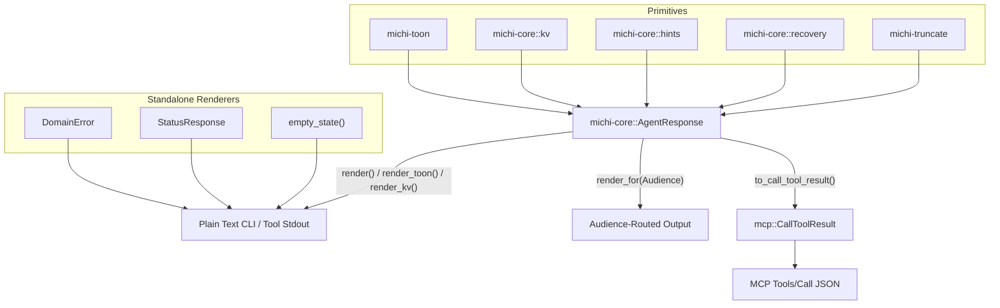

# Architecture

This document describes how the `michi` workspace crates fit together.

## Workspace Layout

`michi` is structured as a Cargo workspace with dedicated, single-responsibility sub-crates in `crates/` and a top-level facade crate:

```text
michi (workspace root)
├── crates/
│   ├── michi-truncate    # O(1) UTF-8 safe string truncation (zero dependencies)
│   ├── michi-resilience  # Backoff delay math, RFC 7231 Retry-After parser, FNV-1a idempotency
│   ├── michi-toon        # TOON format renderer, parser, CompactString cells, ToonSerializer
│   └── michi-core        # Core AXI types: AgentResponse, Audience, Hint, RecoveryHint, DomainError, StatusResponse
├── michi                 # Facade crate re-exporting all sub-crates
└── packages/michi-node   # Node.js NAPI binding (@orin-axi/michi)
```

## Component Overview

| Crate / Package | Layer | Responsibility | Runtime Dependencies |
| --- | --- | --- | --- |
| `michi-truncate` | Layer 1 | UTF-8 char-boundary content truncation (`floor_char_boundary`). | None |
| `michi-resilience` | Layer 1 | Retry backoff math, `Retry-After` HTTP date parsing, FNV-1a idempotency keys. | None |
| `michi-toon` | Layer 1 | TOON list rendering and parsing. Stack-inlined `CompactString` values for cell optimization. | `compact_str` |
| `michi-core` | Layer 2 | High-level response DTOs (`AgentResponse`, `DomainError`, `StatusResponse`, `CallToolResult`). | `thiserror` (Optional: `serde`, `schemars`, `miette`) |
| `michi` | Facade | Root re-export facade (`pub use michi_core::*`, `pub use michi_toon::*`, etc.). | `michi-*` workspace crates |
| `packages/michi-node` | Shim | NAPI C-dylib binding for `@orin-axi/michi`. | `napi`, `napi-derive`, `serde_json` |

## Data Composition & Render Flow

`michi` provides two main entry points for formatting output:

1. **`response::AgentResponse` (Fluent Builder)**: Composes TOON lists, KV items, `help[]` hints, and recovery guidance into a unified output buffer. Supports assistant/user audience routing and direct conversion to MCP `CallToolResult`.
2. **Standalone DTOs**: `DomainError`, `StatusResponse`, `AlreadyDone`, and `empty_state()` render themselves directly into agent-readable KV blocks or GitHub Actions annotations without passing through `AgentResponse`.



## Node.js / NAPI Bridge (`packages/michi-node`)

The Node.js native addon lives in `packages/michi-node` because Cargo requires a separate `cdylib` target definition:

- Public FFI exports, input validation, and bounds checking live in `src/napi.rs` inside the root crate.
- `packages/michi-node/src/lib.rs` re-exports `src/napi.rs` functions across the crate boundary via `pub use michi::napi::*;`.
- `napi-derive` uses linker sections (`ctor`) to register native functions across crate boundaries without manual wrapper boilerplates.

## WASM & Platform Targets

All core workspace crates (`michi-truncate`, `michi-resilience`, `michi-toon`, `michi-core`) compile for `wasm32-unknown-unknown` and `wasm32-wasip1` targets without OS dependencies.
