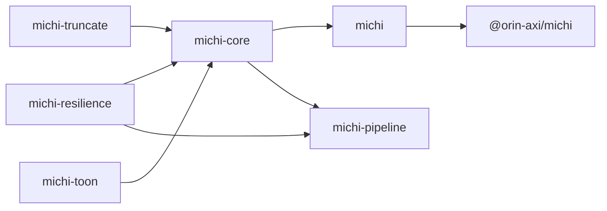

# michi (道)

[](https://github.com/orin-axi/michi/actions/workflows/ci.yml) [](LICENSE)

AXI response primitives for agent-ergonomic tools — TOON lists, key-value blocks, truncation, structured errors, status, and `help[]` hints.

`michi` is the formatting and response layer for the **orin-axi** suite: it turns structured data into token-efficient, agent-readable text. No CLI framework or async runtime required.

Available as a Rust crate (`michi`) or a Node.js package (`@orin-axi/michi`).

> [!IMPORTANT]\
> Not yet published to crates.io or npm. Clone the repo and build from source to try it — see [Local Development](#local-development).

## Why TOON?

Agents pay for every token they read. Standard JSON lists repeat keys on every single object, burning context window capacity:

```json
[
  { "number": 51815, "title": "[Bug]: Telegram plugin", "state": "open" },
  { "number": 51812, "title": "dark mode request", "state": "open" }
]
```

TOON (Token-Optimized Object Notation) states field names once in a tabular header:

```text
issues[2]{number,title,state}:
  51815,[Bug]: Telegram plugin,open
  51812,dark mode request,open
```

Values are quoted only when they contain commas, quotes, or newlines — no quoting overhead on the common case.

## Quick start

### Rust

```rust
use michi::toon::{render_toon, ToonOptions, Value};

let opts = ToonOptions::new(
    "issues",
    vec!["number".to_string(), "title".to_string(), "state".to_string()],
    vec![
        vec![Value::Int(51815), Value::from("[Bug]: Telegram plugin"), Value::from("open")],
        vec![Value::Int(51812), Value::from("dark mode request"), Value::from("open")],
    ],
)
.total_count(Some(8771))
.hints(vec!["Run `gh-axi issue view <number>` to view an issue".to_string()]);

print!("{}", render_toon(&opts));
```

### TypeScript / Node.js

```typescript
import { renderToon } from "@orin-axi/michi";

const out = renderToon({
  typeName: "issues",
  fields: ["number", "title", "state"],
  rows: [
    [
      { type: "int", intVal: 51815 },
      { type: "str", strVal: "[Bug]: Telegram plugin" },
      { type: "str", strVal: "open" },
    ],
    [
      { type: "int", intVal: 51812 },
      { type: "str", strVal: "dark mode request" },
      { type: "str", strVal: "open" },
    ],
  ],
  totalCount: 8771,
  hints: ["Run `gh-axi issue view <number>` to view an issue"],
});

process.stdout.write(out);
```

### Output

```text
issues[2]{number,title,state}:
  51815,[Bug]: Telegram plugin,open
  51812,dark mode request,open
totalCount: 8771
help[1]:
  Run `gh-axi issue view <number>` to view an issue
```

## Workspace Architecture

`michi` is organized as a Cargo workspace: zero-dependency primitive crates by default, `michi-pipeline` as the one exception (it needs `tokio` for async execution), plus optional feature flags on the facade crate:



| Crate / Module | Description |
| --- | --- |
| `michi-truncate` | UTF-8 char-boundary safe string truncation (`floor_char_boundary`). Zero runtime dependencies. |
| `michi-resilience` | Exponential back-off math, RFC 7231 `Retry-After` header parser, and FNV-1a idempotency keys. |
| `michi-toon` | TOON list renderer and parser powered by `compact_str::CompactString`. Includes direct `serde::Serializer`. |
| `michi-core` | Core AXI response types (`AgentResponse`, `Audience`, `Hint`, `RecoveryHint`, `StatusResponse`, `DomainError`, `CallToolResult`). |
| `michi-pipeline` | Async pipeline execution: sequential and concurrent step running, circuit breaking, cooperative cancellation. Depends on `tokio`; versioned and released independently of the rest of the workspace. |
| `michi` | Facade crate re-exporting all sub-crates for convenient top-level access. |
| `@orin-axi/michi` | Node.js NAPI bindings built with `@napi-rs/cli`. |

## Feature Flags

| Feature | Adds | Purpose |
| --- | --- | --- |
| `serde` | `serde`, `serde_json` | Enables `Serialize`/`Deserialize` on types and direct `toon::list()` generation. |
| `schemars` | `schemars` | Derives `JsonSchema` on DTO types for automatic MCP `outputSchema` generation. |
| `miette` | `miette` | Implements `miette::Diagnostic` for `DomainError` to render colorized CLI diagnostic cards. |
| `napi` | `napi`, `napi-derive`, `serde_json` | Enables Node.js native addon compilation. |

The default build (`default = []`) has zero runtime dependencies beyond `thiserror`.

## Local Development

```bash
just check-all   # Run formatting, clippy, WASM check, rustdoc, and test suites
just test        # Run Rust tests and Node.js NAPI tests
just check-wasm  # Verify compilation on wasm32-unknown-unknown
just bench       # Run Divan performance benchmarks
```

## License

AGPL-3.0-or-later. See [`LICENSE`](LICENSE).
