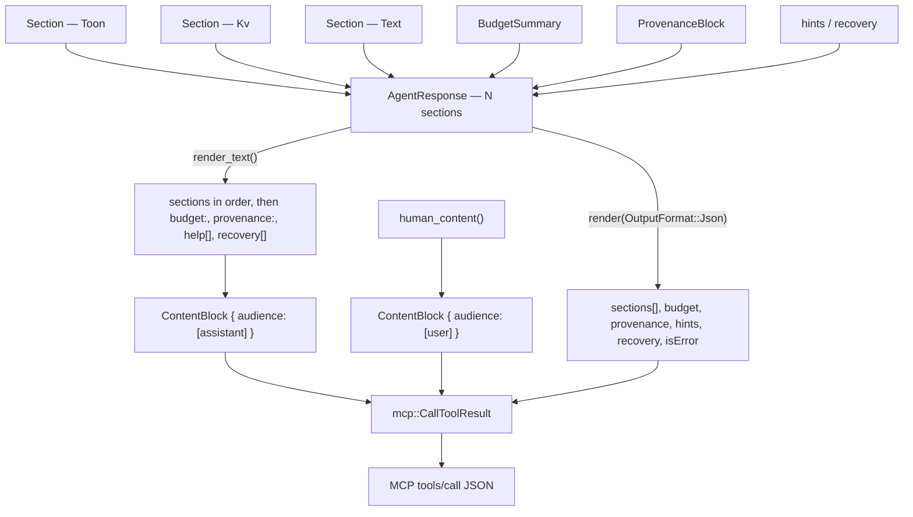

# The Wisp / monokl Response Envelope

What `michi-core` has to add so that **one** `AgentResponse` can carry a monokl batch result or a Wisp briefing: several named sections, one budget report, one provenance record, and per-operation outcomes that keep their position.

This is the michi half of a contract written down in three places. monokl's `docs/spec/08-library-session-api.md` §7 defines the batch `QueryResponse`; Wisp's `docs/02-architecture-and-contracts.md` §11–§12 defines the MCP surface that renders it; this doc defines what michi must hold for either of them to render through it. Nothing here changes how michi serializes MCP — that part is already right.

## The gap

`AgentResponse` today holds exactly one body. From `crates/michi-core/src/response.rs`:

| Field / type | Line | What it constrains |
| --- | --- | --- |
| `type_name: String` | 33 | One name for the whole response |
| `items: Vec<Vec<Value>>` + `fields: Vec<String>` | 34–35 | One TOON slot |
| `single_item: Vec<KvItem>` | 36 | One KV slot |
| `total_count: Option<usize>` | 37 | One count, for whichever slot renders |
| `enum RenderTarget { Unset, Toon, Kv }` | 19–23 | The two slots are mutually exclusive |
| `truncate_cells_at: usize` | 40 | Per-cell clamp, TOON path only (`DEFAULT_TRUNCATE_CELLS = 200`, line 26) |

`items()` (line 65) sets `target = RenderTarget::Toon`; `kv_items()` (line 81) sets `Kv`; `body()` (line 143) dispatches on `target`, so `render()` reads whichever setter ran last. Calling both silently drops one. A ten-operation batch is not expressible: nine sections disappear with no error and no signal that they existed.

The truncation model has the same shape problem one level down. `truncate_cells_at` clamps a cell. `michi_truncate::Truncated { content, original_len, was_truncated, signal }` describes a string. Neither describes a response. The only envelope-level "there is more" signal is `total_count: Option<usize>` — a bare integer with no per-section breakdown, no relation to a budget, and no way to say why anything was dropped. monokl's `BudgetReport` would have to be flattened into free-text `hint()` calls to reach the agent at all.

## What gets added

Five additions, in dependency order. All five are pure michi and always compiled — nothing here reaches outside the michi workspace for a type. The fourth changes an existing rendered format; the fifth extends `structured_content`.

### 1. Repeatable sections

```rust
/// One named block within a response. A response may hold any number.
#[derive(Debug, Clone)]
#[non_exhaustive]
pub struct Section {
    /// The section's type name — the identifier at the head of its TOON line, or the KV block's label.
    pub name: String,
    /// The section's contents.
    pub body: SectionBody,
    /// How many items this section actually carries.
    pub returned_count: usize,
    /// How many existed before truncation. `Some(n)` with `n > returned_count` is the "there is more" signal.
    pub total_count: Option<usize>,
    /// Whether producing this section dropped anything.
    pub truncated: bool,
}

#[derive(Debug, Clone)]
#[non_exhaustive]
pub enum SectionBody {
    /// A uniform list. Rendered through `michi_toon::ToonOptions`, per-cell truncation applied.
    Toon { fields: Vec<String>, rows: Vec<Vec<Value>> },
    /// A single receipt or a small set of labelled scalars.
    Kv(Vec<KvItem>),
    /// Prose or an already-rendered fragment michi passes through unchanged.
    Text(String),
}

impl Section {
    pub fn toon(name: impl Into<String>, fields: Vec<String>, rows: Vec<Vec<Value>>) -> Self;
    pub fn kv(name: impl Into<String>, items: Vec<KvItem>) -> Self;
    pub fn text(name: impl Into<String>, body: impl Into<String>) -> Self;
    /// Record the pre-truncation count. `total_count(Some(n))` with `n > returned_count` renders `totalCount: n`.
    pub fn total_count(self, total: Option<usize>) -> Self;
    pub fn truncated(self, truncated: bool) -> Self;
}

impl AgentResponse {
    /// Append a section. Sections render in insertion order — the caller owns ordering,
    /// because ordering is a policy the caller A/Bs (Wisp D-018), not something michi decides.
    #[must_use]
    pub fn section(self, s: Section) -> Self;
}
```

`items()` and `kv_items()` stay, as one-section sugar over the same storage: `items(rows, fields)` becomes `section(Section::toon(self.type_name.clone(), fields, rows))`, `kv_items(items)` becomes `section(Section::kv(self.type_name.clone(), items))`. `RenderTarget` survives as the record of which sugar was used, because `render_toon()` and `render_kv()` are documented to read their named slot unconditionally regardless of the last setter (AC-009) and that behavior has to hold.

Two invariants keep this compatible with what already ships:

- **A response with zero or one section renders byte-for-byte as it does today**, on every one of `render(Text)`, `render(Json)`, `render_toon()`, `render_kv()`, and `render_for()`. The existing `insta` snapshots are the test for this; if any of them moves, the change is wrong. Per the SemVer table in [05-scope-and-quality.md](05-scope-and-quality.md) a rendered-output change is a major bump, and multi-section support does not have to be one.
- **`returned_count` is derived, not trusted, for `Toon` and `Kv` bodies.** Render functions always succeed ([`PRINCIPLES.md`](../../PRINCIPLES.md)), so a `returned_count` disagreeing with `rows.len()` / `items.len()` is clamped to the real length with a `debug_assert!` alongside — the assert fires under `cargo nextest`, the clamp runs in release. `Text` bodies keep whatever the caller declared, since michi cannot count items in prose.

Rendered, a two-section response is just the sections in order:

```text
brief.symbols[12]{name,kind,file,line}:
  RetryPolicy,struct,src/retry/policy.rs,14
  …
totalCount: 40
brief.refs[5]{symbol,file,line}:
  RetryPolicy,src/http/client.rs,88
  …
```

### 2. A response-level budget report

```rust
/// What a budget block renders: the ceilings a caller was working under, what the response cost
/// against them, and what that cost each section. michi owns this type and names nothing from
/// Wisp or monokl.
#[derive(Debug, Clone, Default)]
#[non_exhaustive]
pub struct BudgetSummary {
    /// Ceilings the caller set. Any of the three may be absent.
    pub max_tokens: Option<u64>,
    pub max_bytes: Option<u64>,
    pub max_items: Option<u64>,
    /// What the response cost, as the caller measured it.
    pub tokens_used: Option<u64>,
    pub bytes_used: Option<u64>,
    /// Whether the budget forced anything out of the response.
    pub truncated: bool,
    /// Per-section accounting, rendered in the order given.
    pub sections: Vec<SectionCost>,
}

/// One section's line in the budget roll-up.
#[derive(Debug, Clone)]
#[non_exhaustive]
pub struct SectionCost {
    pub name: String,
    pub returned: u64,
    /// How many existed before truncation, when the caller knows.
    pub total: Option<u64>,
    pub truncated: bool,
}

impl AgentResponse {
    /// Attach the response-level budget summary. One per response — a batch has one budget.
    #[must_use]
    pub fn budget(self, b: BudgetSummary) -> Self;
}
```

Every number is an `Option` or a plain counter, so a caller who measured only tokens fills two fields and leaves the rest empty. `u64` rather than `usize` because these values reach JSON, where a platform-dependent width means nothing.

Rendered once, after the last section, as a `budget:` KV block, with a roll-up naming each section's returned and total counts:

```text
budget:
  tokensUsed: 7412
  bytesUsed:  31208
  maxTokens:  8000
  maxBytes:   2097152
  truncated:  true
sections[2]{name,returned,total,truncated}:
  brief.symbols,12,40,true
  brief.refs,5,5,false
```

Absent fields are omitted rather than rendered as `null`. The roll-up renders only when the response carries two or more sections. A single-section response already states its count in its own TOON header and `totalCount:` line, and repeating it costs tokens for nothing.

michi renders a budget; it never computes one. Which items survive a budget is the caller's decision — a BM25 cutoff, a reserved-floor allocator, monokl's `apply_budget` degrade-then-drop ladder. Reporting what got cut in a consistent agent-readable shape is the part every caller needs identically, which is exactly the split [`PRINCIPLES.md`](../../PRINCIPLES.md) describes for truncation.

### 3. A provenance slot

```rust
/// What a provenance block renders: a short ordered list of labelled values, plus the one string
/// a freshness check compares. michi assigns no meaning to any of them.
#[derive(Debug, Clone, Default)]
#[non_exhaustive]
pub struct ProvenanceBlock {
    /// Rendered in order, one `label: value` line each.
    pub entries: Vec<ProvenanceEntry>,
    /// Rendered last when present.
    pub fingerprint: Option<String>,
}

#[derive(Debug, Clone)]
#[non_exhaustive]
pub struct ProvenanceEntry {
    pub label: String,
    pub value: String,
}

impl AgentResponse {
    /// Attach the provenance block this response was computed against.
    /// One per response: a batch runs against one snapshot, so it has one provenance.
    #[must_use]
    pub fn provenance(self, p: ProvenanceBlock) -> Self;
}
```

A named pair rather than a `(String, String)` tuple: a tuple serializes as a two-element array, and a third-party reader of `structuredContent` then has nothing to key on.

Rendered as a KV block after `budget:`:

```text
provenance:
  analyzer:    rust-analyzer@0.3.2
  observedAt:  1756950000000
  precision:   exact
  fingerprint: b3f1c0d2e4a58691
```

One block per response, not one per row — monokl's batch executes against a single `Snapshot`, so one fingerprint covers all N results rather than N fingerprints. Wisp's freshness tool (`wisp_check`) compares exactly the string in `fingerprint`.

The caller picks the labels. `monokl-agent` fills them from the `wisp_contracts::Provenance` its snapshot carries, `wisp-output` from the same type on Wisp's side, and a tool with no analyzer at all fills two entries and no fingerprint. michi renders what it was handed and validates none of it.

Per-edge precision stays out of the envelope. monokl carries `CapabilityPrecision` on each `DependencyEdge` and each `OpBudget` because a batch spanning an `Exact` TypeScript `refs` and a `Structural` Rust `dependents` has no honest single precision. michi renders whatever precision the caller wrote into a row or a provenance entry; it does not reduce several of them to one response-level value, and it has no type that could hold such a value.

### 4. Per-op outcomes: `PartialSuccess`, widened

`idempotency::PartialSuccess` already has the completed/failed/skipped trichotomy a batch needs. What it lacks is position: `Vec<String>` cannot express `results[i]` ↔ `ops[i]`, which is the ordering contract the batch API is built on (DataLoader's rule, restated in monokl §7.4 as an invariant). Reuse the type, widen the identifiers:

```rust
/// One operation's identity within a batch.
#[derive(Debug, Clone, PartialEq, Eq)]
#[non_exhaustive]
pub struct OpRef {
    /// Position in the caller's op slice. `results[index]` answers `ops[index]`.
    pub index: usize,
    /// Display name for the operation.
    pub operation: String,
    /// A stable machine token — `budget_exhausted`, `deadline`, `not_indexed` — never prose.
    /// michi does not define the vocabulary; the caller does.
    pub reason: Option<String>,
}

pub struct PartialSuccess {
    pub completed: Vec<OpRef>,   // was Vec<String>
    pub failed: Vec<FailedOp>,
    pub skipped: Vec<OpRef>,     // was Vec<String>
}

pub struct FailedOp {
    /// Position in the caller's op slice.
    pub index: usize,            // new
    pub operation: String,
    pub reason: String,
    pub recovery: Option<RecoveryHint>,
}
```

The index becomes a rendered column, so the correspondence survives into what the agent reads:

```text
partial_success: 2 completed, 1 failed, 1 skipped
completed[2]{index,operation}:
  0,symbols
  1,dependents
failed[1]{index,operation,reason}:
  2,refs,"symbol not found: RetryPolicy"
skipped[1]{index,operation,reason}:
  3,search,budget_exhausted
```

**This one is a major bump.** Today's `completed[2]:` bare-list block becomes `completed[2]{index,operation}:`, so existing rendered output differs — the SemVer table calls that major, and the snapshot tests in `idempotency.rs` (AC-032, AC-033) change with it. There is no external consumer to break yet, which is the cheapest moment this change will ever have.

`exit_code()` is unchanged: `0` when nothing failed, `1` when anything did.

### 5. `structured_content` and a published `outputSchema`

`to_call_tool_result()` already builds `structured_content` from `render(OutputFormat::Json)`. Extend that JSON to carry the envelope:

```json
{
  "body": "…",
  "sections": [
    {
      "name": "brief.symbols",
      "kind": "toon",
      "fields": ["name", "kind", "file", "line"],
      "rows": [["RetryPolicy", "struct", "src/retry/policy.rs", 14]],
      "returnedCount": 12,
      "totalCount": 40,
      "truncated": true
    }
  ],
  "budget": { "tokensUsed": 7412, "bytesUsed": 31208, "maxTokens": 8000, "truncated": true, "sections": [] },
  "provenance": {
    "entries": [{ "label": "analyzer", "value": "rust-analyzer@0.3.2" }],
    "fingerprint": "b3f1c0d2e4a58691"
  },
  "hints": ["…"],
  "recovery": [],
  "isError": false
}
```

Every key in that object is camelCase — `returnedCount`, `totalCount`, `tokensUsed`, `maxTokens`, `isError`. The rendered examples above are the specification of that, not an illustration of it: a third-party harness plugin reading this JSON without linking any Rust is a first-class consumer, and `#[serde(rename_all = "camelCase")]` on every envelope type is what keeps the spelling stable. Labels inside `provenance.entries` are caller-supplied strings and michi does not case-convert them.

`sections`, `budget`, and `provenance` appear only when their slots are set. A response built entirely through today's API still emits exactly `body`, `hints`, `recovery`, `isError` — the four keys AC-004 pins — so that criterion needs its assertion rewritten from "exactly this set" to "exactly this set, plus the envelope keys whose slots were set", not deleted.

The schema is published through the existing `schemars` feature: `Section`, `SectionBody`, `BudgetSummary`, `SectionCost`, `ProvenanceBlock`, and `ProvenanceEntry` derive `JsonSchema`, and the server declares the result as its tool's `outputSchema`. MCP makes conformance binding once a schema is declared — servers MUST return conforming structured results, clients SHOULD validate — which is the reason to publish one rather than leave the shape implicit. The token-budget caveat in [06-decisions.md](06-decisions.md) still applies: `outputSchema` enters the context window at `tools/list` time, so declare it on always-loaded tools, not on deferred ones.

## The render path



Everything below `AgentResponse` in that diagram already exists and is unchanged. `CallToolResult { content, is_error, structured_content }`, `ContentBlock.audience: Vec<Audience>` matching MCP's array-typed `annotations.audience`, the private `*Wire` structs that add the `"type": "text"` discriminator and nest `audience` under `annotations`, and `structured_content` parsed into embedded JSON rather than double-encoded — see [04-mcp-and-napi.md](04-mcp-and-napi.md). The gap is in what `AgentResponse` can hold, not in how it reaches the wire.

## Where these types come from

`Section`, `SectionBody`, `BudgetSummary`, `SectionCost`, `ProvenanceBlock`, and `ProvenanceEntry` are defined in `michi-core`. michi reaches outside its own workspace for none of them, and in particular it does not depend on `wisp-contracts`.

That is a change from an earlier draft of this document, which imported `wisp_contracts::BudgetReport` and `wisp_contracts::Provenance` behind an optional `contracts` feature. michi publishes to crates.io first, so a michi release cannot name a crate that is not published yet — and a feature gate does not fix an ordering problem, since an optional dependency still has to resolve. The vocabulary argument that justified the import is sound and unchanged: `Provenance` and `BudgetReport` are meanings Wisp and monokl must agree on, and they belong in a permissively licensed crate for the harness plugins that cannot link AGPL code. What michi needs is not that meaning. It is the handful of numbers and strings a block renders, which is a smaller thing, and michi's own.

The conversion lives in the consumer, which already links both sides:

| Consumer | Holds | Converts into |
| --- | --- | --- |
| `wisp-output` | `wisp_contracts::BudgetReport`, filled by `wisp-context`'s per-section allocator | `BudgetSummary` |
| `monokl-agent` | `wisp_contracts::BudgetReport`, filled by its own `apply_budget` | `BudgetSummary` |
| both of the above | `wisp_contracts::Provenance`, read off the snapshot the batch ran against | `ProvenanceBlock` |

Each conversion is a few dozen lines of field copying in a crate that imports contracts anyway. michi imports it in no build, and learns nothing about how a `Budget` is allocated, what a `WorkspaceFingerprint` hashes, or how `CapabilityPrecision` ranks.

`michi renders a budget; it never computes one` is what makes that split hold. Under monokl `08 §7.5` there are two independent producers of a budget report — `monokl-agent` for the CLI and Wisp's `wisp-context` for a briefing — and michi is the only renderer both share. A renderer needs the numbers, not the allocator that produced them, so the numbers are all the envelope takes.

**No new feature flag.** All six types are built from types michi already owns, so all six are always compiled and gate 2's zero-dep default is untouched — there is no dependency to gate. `render_json()` stays hand-built and `serde_json`-free: michi owns these shapes, so it emits their keys the way it emits every other key today, and the `budget` and `provenance` JSON keys appear in a default build. The `serde` and `schemars` derives ride the existing optional features and add nothing to the default.

## Rules this envelope has to hold

| Rule | Why |
| --- | --- |
| **Never fail closed on overflow.** Partial results, plus counts, plus a refinement hint. Never "no content is returned." | Serena's `find_symbol` returns nothing once `max_answer_chars` is exceeded, leaving the agent to guess a narrower query with no information about what it missed. Partial results plus `total_count` plus a hint naming the refinement operator is strictly more useful, and it is the behavior monokl already has. Wisp D-019 states the same rule for its MCP surface. |
| **No pagination cursors on tool results.** | MCP defines `cursor`/`nextCursor` only for list operations — `tools/list` paginates, `tools/call` results have no cursor field, and the 2026-07-28 release candidate does not add one. A cursor on a tool result is a private convention no client will honor. Truncation plus counts plus a hint is the signal that works. |
| **TOON for five or more uniform rows; KV for a single receipt.** | TOON's saving comes from stating field names once across many rows. Below roughly five rows the header costs more than the repetition it removes, and a one-item result reads better as `key: value` lines. `SectionBody` carries both so one response can mix them section by section. |
| **michi never reads its own TOON back.** | TOON is a rendering target. No render path parses it, and no consumer should: a caller that needs the data as data reads `structured_content`, which carries the same values already typed. Wisp states the same rule for itself. The round-trip parser exists to prove the renderer's output is grammar-valid in property tests, not as a data path. |
| **Sections render in insertion order.** | Ordering is a policy the caller measures (Wisp's Prism A/Bs it). michi renders what it was handed, in the order it was handed. |

## The Wisp arrangement

Wisp's `wisp-output` crate depends on michi through a **local path dependency during coordinated development**, and the publish order runs one way: michi publishes first, and Wisp is not published until michi has a versioned release compatible with Wisp's license and MSRV (Wisp D-006). michi's declared MSRV is `1.96`.

Nothing in Wisp gates a michi release, which is the practical reason the `wisp-contracts` import is gone: michi's manifest now names no crate that has to reach crates.io before michi does. Nor does this relax michi's own publish gate, which earns a crates.io release with a real consumer integration rather than internal completeness ([`PRINCIPLES.md`](../../PRINCIPLES.md), heuristic 5). The integration is real before the release, not after it: this envelope lands in michi → Wisp integrates against the path dependency → the integration is exercised → michi cuts a versioned release → Wisp depends on the release and can itself be published. A tagged git dependency (`michi = { git = "…", tag = "v0.x.y" }`) is the documented interim step if Wisp needs a pinned reference before crates.io.

Licensing is settled, not open. michi is `FSL-1.1-MIT`, matching Wisp's upper layers and Lumen, and monokl carries the same license. With all three on `FSL-1.1-MIT`, the FSL-linking-AGPL redistribution conflict this section used to flag no longer exists.

## What this is not

**Not a Wisp type, and not a monokl type.** `Section`, `SectionBody`, `BudgetSummary`, and `ProvenanceBlock` name nothing from either domain, and michi's manifest names neither crate. Any orin-axi tool returning heterogeneous results in one call — a status command reporting several subsystems, a CLI answering a compound query — uses the same envelope, and a tool with one list still writes `items()` and never sees a `Section`.

**Not a batch executor.** michi has no async runtime and no scheduler. Dedupe, deadlines, snapshot atomicity, and the budget allocation policy are monokl's `query()`; michi receives the outcome and renders it.

**Not a budget allocator.** `BudgetSummary` is a record of a decision already made. Which items survive is the caller's algorithm, and michi has no opinion about it.

**Not the whole of what monokl asks michi for.** `MICHI-ADJUSTMENTS.md` under monokl's `.claude/plans/` carries a separate set of asks that nothing in this document covers and nothing in michi's own spec pipeline schedules: five bug fixes (`escape_value` dropping newlines, `toon::list()` deriving columns from the first row only, a `debug_assert!` arity panic, `AgentResponse::toon_body()` swallowing `validate()` failures, and unsanitized newlines in `DomainError::render()` and its hints), an implementation of the `TruncationOutcome<T>` / `truncate_by_bytes` pair already sketched in [`PRINCIPLES.md`](../../PRINCIPLES.md), and a `DomainError::from_error_chain()` helper. It explicitly does not propose new `ErrorCode` variants. None of it contradicts this envelope — it is orthogonal work on escaping, truncation, and error rendering — but it is filed in another repository's planning directory, so it needs michi-side requirements before it can be gated. Recorded here so the gap is visible rather than discovered when one of the five bugs surfaces under a multi-section response.

**Not fully clear of michi's third gate yet, and the honest reading matters.** The gate asks for independent real tools that would otherwise hand-roll the identical pattern, and warns that one tool using a pattern heavily is one data point rather than proof. monokl's batch response and Wisp's briefing are two consumers, but Wisp consumes monokl, so they are not independent in the sense the gate means. What carries the case is the survey behind it: across Sourcegraph, Serena, MCP itself, and LSP, nobody attaches a single top-level budget report across multiple result sections — the pattern is absent from the prior art rather than reinvented in it. That is an argument from a gap, which is weaker than the four-for-four evidence `help[]` hints cleared the gate with. Whether that argument carries the gate on its own, whether a third michi consumer has to show up first, or whether the gate is waived for this envelope, is michi's call and nobody else's — Wisp does not clear michi's gates, and michi does not wait on Wisp to attempt it.
