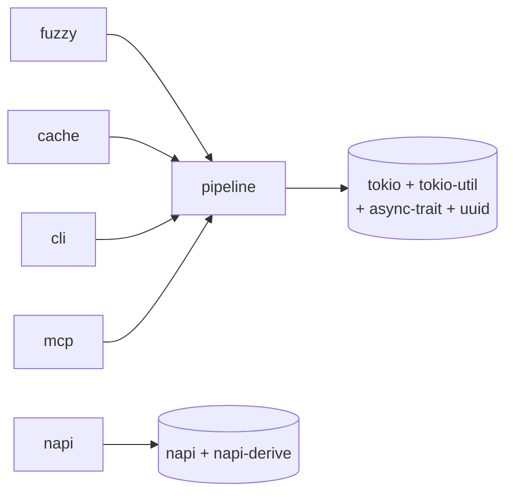
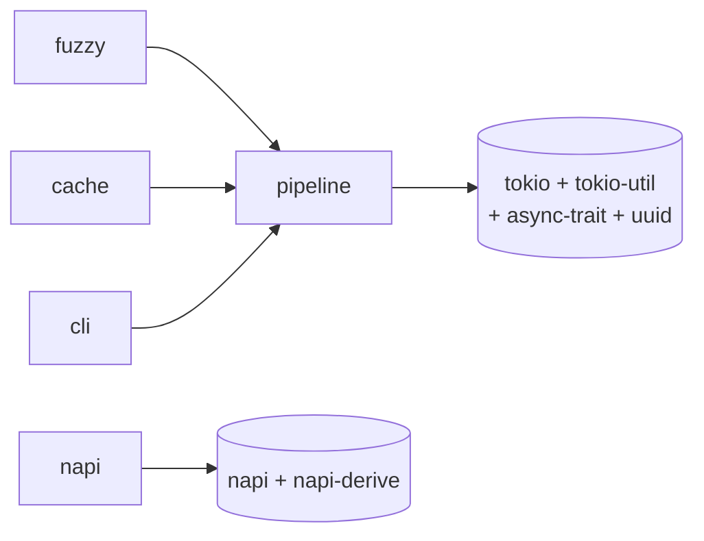

# `render_for(Audience)` Implementation Plan

> **For agentic workers:** REQUIRED SUB-SKILL: Use superpowers:subagent-driven-development (recommended) or superpowers:executing-plans to implement this plan task-by-task. Steps use checkbox (`- [ ]`) syntax for tracking.

**Goal:** Give CLI consumers the same dual agent/human output MCP consumers already have —
`AgentResponse::render_for(audience)` and `has_human_content()`, both mirrored over NAPI — per
`docs/superpowers/specs/2026-07-22-cli-agent-render-for.md`, and fold the resulting documentation
across every file that needs it, including two pre-existing staleness bugs found along the way.

**Architecture:** Sequential. `Audience` relocates out of `src/mcp.rs` into its own
`src/audience.rs` first (Task 1) — every other Rust change depends on that being done and the
build green again before proceeding. Then the new methods (Tasks 2–3), then documentation
(Tasks 4–9), which depends on the final code shape being settled.

**Tech Stack:** Rust (stable), `cargo nextest`, existing `serde`/`napi` features (no new
dependencies — this whole feature adds zero Cargo.toml changes).

---

## Task 1: Relocate `Audience` from `src/mcp.rs` to `src/audience.rs`

**Files:**
- Create: `src/audience.rs`
- Modify: `src/mcp.rs`
- Modify: `src/lib.rs`
- Modify: `src/response.rs` (5 call sites)
- Modify: `src/napi.rs` (2 call sites)
- Modify: `tests/proptest_mcp.rs` (import path only — see Step 2)

Pure relocation — no behavior change, so no new test is written for this task. Verification is
running the existing test suite and confirming every existing `Audience`-related test still
passes unchanged.

- [ ] **Step 1: Create `src/audience.rs`**

```rust
//! Which surface a piece of content is meant for — the model reading it, or
//! a human. Not MCP-specific despite MCP being its first consumer: any
//! response-rendering context that distinguishes agent-facing from
//! human-facing output uses this same type. See
//! [`crate::response::AgentResponse::render_for`] and
//! [`crate::response::AgentResponse::to_call_tool_result`].

/// Which surface a piece of content is meant for. Mirrors MCP's
/// `annotations.audience` — an array in the real protocol because one block
/// can target more than one audience; michi always populates exactly one
/// element per block today (see [`crate::mcp::ContentBlock::audience`]), but
/// the field is a `Vec` so no translation is needed at the serialization
/// boundary.
#[derive(Debug, Clone, Copy, PartialEq, Eq)]
#[cfg_attr(feature = "serde", derive(serde::Serialize, serde::Deserialize))]
#[cfg_attr(feature = "serde", serde(rename_all = "lowercase"))]
pub enum Audience {
    /// The compact, token-efficient surface — what michi renders today.
    Assistant,
    /// A human-readable surface, supplied by the caller. michi does not
    /// generate this text itself (see this crate's Non-goals: no
    /// display-format Markdown) — it only carries it correctly through to
    /// whichever output the caller asked for.
    User,
}

#[cfg(test)]
mod tests {
    use super::*;

    #[test]
    fn audience_is_copy_and_comparable() {
        let a = Audience::Assistant;
        let b = a;
        assert_eq!(a, b);
        assert_ne!(Audience::Assistant, Audience::User);
    }

    #[test]
    #[cfg(feature = "serde")]
    fn audience_serializes_and_deserializes() {
        let a = Audience::Assistant;
        let json = serde_json::to_string(&a).expect("serializes");
        let back: Audience = serde_json::from_str(&json).expect("deserializes");
        assert_eq!(a, back);
    }

    #[test]
    #[cfg(feature = "serde")]
    fn audience_serializes_lowercase() {
        assert_eq!(serde_json::to_string(&Audience::Assistant).expect("serializes"), "\"assistant\"");
        assert_eq!(serde_json::to_string(&Audience::User).expect("serializes"), "\"user\"");
    }
}
```

(This is the exact `Audience` definition and its two serde tests, moved verbatim out of
`src/mcp.rs` — same derives, same doc comment content adjusted only to drop the MCP-specific
framing. The `content_block_carries_text_and_audience`/`call_tool_result_is_constructible`/etc.
tests in `mcp.rs` stay in `mcp.rs`, unchanged — they test `ContentBlock`/`CallToolResult`, not
`Audience` itself.)

- [ ] **Step 2: Remove `Audience` from `src/mcp.rs`, import it instead**

In `src/mcp.rs`, delete the `Audience` enum definition (lines 15–31 in the current file — the
`#[derive(...)] pub enum Audience { ... }` block and its doc comment) and the two
`Audience`-specific tests now living in `audience.rs`
(`audience_serializes_and_deserializes`, `audience_serializes_lowercase`).

Add near the top of the file, after the module doc comment:
```rust
use crate::audience::Audience;
```

The module doc comment (lines 1–13) needs no change — it never names `Audience` explicitly.

This `use` is private (not `pub use`), so `crate::mcp::Audience`/`michi::mcp::Audience` stops
being a valid path once this lands — only `crate::audience::Audience`/`michi::audience::Audience`
(and the crate-root `michi::Audience` re-export from Step 3) resolve. `tests/proptest_mcp.rs`
imports `Audience` via `michi::mcp::{Audience, ...}` today, so it needs its import split
accordingly — see Step 6.

- [ ] **Step 3: Update `src/lib.rs`**

Add the new module declaration, alphabetically first (before `empty`):
```rust
/// Which surface a piece of content is meant for — the model or a human.
pub mod audience;
```

Update the crate-root re-export block. Find:
```rust
pub use mcp::{Audience, CallToolResult, ContentBlock};
```
Replace with (and add the new `audience::Audience` re-export in the correct alphabetical
position, immediately before the existing `empty::empty_state` line):
```rust
pub use audience::Audience;
```
```rust
pub use mcp::{CallToolResult, ContentBlock};
```

- [ ] **Step 4: Update the 5 call sites in `src/response.rs`**

Every occurrence of `crate::mcp::Audience::Assistant` → `crate::audience::Audience::Assistant`,
and `crate::mcp::Audience::User` → `crate::audience::Audience::User`. Exact locations (current
line numbers, verify against the file before editing since earlier tasks in this plan may shift
them slightly):
- In `to_call_tool_result()`'s body (2 occurrences: the assistant block, the user block).
- In 3 test functions asserting on `result.content[N].audience`.

- [ ] **Step 5: Update the 2 call sites in `src/napi.rs`**

In `to_call_tool_result()`'s body, the `match a { crate::mcp::Audience::Assistant => ...,
crate::mcp::Audience::User => ... }` arms both need `crate::mcp::Audience` →
`crate::audience::Audience`.

- [ ] **Step 6: Update the import in `tests/proptest_mcp.rs`**

Step 2's `use` (not `pub use`) means `michi::mcp::Audience` is no longer a valid external path.
Find:
```rust
use michi::mcp::{Audience, CallToolResult, ContentBlock};
```
Replace with:
```rust
use michi::audience::Audience;
use michi::mcp::{CallToolResult, ContentBlock};
```
No other changes to this file — every use of `Audience` in its body (`audience_strategy()`
etc.) is unaffected since the type it names is unchanged, only its import path.

- [ ] **Step 7: Verify nothing broke**

Run: `cargo build -p michi --all-features && cargo nextest run -p michi --all-features`
Expected: clean build, all existing tests pass unchanged — including the new
`audience::tests::*` tests and every `mcp::tests::*`/`response::tests::*`/`napi::tests::*` test
that touches `Audience`.

Run: `cargo clippy -p michi --all-features -- -D warnings && cargo fmt -p michi -- --check`
Expected: clean.

- [ ] **Step 8: Commit**

```bash
git add src/audience.rs src/mcp.rs src/lib.rs src/response.rs src/napi.rs tests/proptest_mcp.rs
git commit -m "refactor: relocate Audience from mcp.rs to its own audience.rs module"
```

---

## Task 2: Add `AgentResponse::render_for()` and `has_human_content()`

**Files:**
- Modify: `src/response.rs`

- [ ] **Step 1: Write the failing tests**

Add to `src/response.rs`'s test module, near the other `to_call_tool_result_*` tests:
```rust
    #[test]
    fn render_for_assistant_matches_render_text_toon_path() {
        let r = AgentResponse::new("issues").items(vec![vec![Value::Int(1)]], &["id"]);
        assert_eq!(r.render_for(crate::audience::Audience::Assistant), r.render_toon());
    }

    #[test]
    fn render_for_assistant_matches_render_text_kv_path() {
        let r = AgentResponse::new("issue").kv_items(vec![KvItem { key: "id".into(), value: KvValue::Int(1) }]);
        assert_eq!(r.render_for(crate::audience::Audience::Assistant), r.render_kv());
    }

    #[test]
    fn render_for_user_returns_human_content_when_set() {
        let r = AgentResponse::new("issue").kv_items(vec![]).human_content("A friendly summary.");
        assert_eq!(r.render_for(crate::audience::Audience::User), "A friendly summary.");
    }

    #[test]
    fn render_for_user_falls_back_to_agent_rendering_when_unset_toon_path() {
        let r = AgentResponse::new("issues").items(vec![vec![Value::Int(1)]], &["id"]);
        assert_eq!(r.render_for(crate::audience::Audience::User), r.render_toon());
    }

    #[test]
    fn render_for_user_falls_back_to_agent_rendering_when_unset_kv_path() {
        let r = AgentResponse::new("issue").kv_items(vec![KvItem { key: "id".into(), value: KvValue::Int(1) }]);
        assert_eq!(r.render_for(crate::audience::Audience::User), r.render_kv());
    }

    #[test]
    fn has_human_content_reflects_whether_it_was_set() {
        let without = AgentResponse::new("t").kv_items(vec![]);
        assert!(!without.has_human_content());
        let with = AgentResponse::new("t").kv_items(vec![]).human_content("hi");
        assert!(with.has_human_content());
    }
```

- [ ] **Step 2: Run tests to verify they fail**

Run: `cargo nextest run -p michi render_for_\|has_human_content_reflects`
Expected: FAIL — `render_for`/`has_human_content` don't exist yet on `AgentResponse`.

- [ ] **Step 3: Implement**

In `src/response.rs`, add both methods to `impl AgentResponse`, immediately after
`render_hints_only()` and before `to_call_tool_result()`:

```rust
    /// Render for the given audience. `Assistant` reads whichever of
    /// `.items()`/`.kv_items()` was populated last — identical to
    /// `render(OutputFormat::Text)`. `User` returns `human_content` if the
    /// caller set one; if not, it falls back to that same agent-oriented
    /// rendering rather than an empty string or a panic.
    ///
    /// That fallback is a real behavior to design around, not just a safety
    /// net: TOON/KV text is comma-syntax built for a model to parse, not
    /// for a human to read comfortably. A caller intending to actually use
    /// the `User` path should call `.human_content()` first — use
    /// [`Self::has_human_content`] to check before rendering if the
    /// response was built somewhere that may not have set it.
    #[must_use]
    pub fn render_for(&self, audience: crate::audience::Audience) -> String {
        match audience {
            crate::audience::Audience::Assistant => self.render_text(),
            crate::audience::Audience::User => {
                self.human_content.clone().unwrap_or_else(|| self.render_text())
            }
        }
    }

    /// Whether `.human_content()` was set on this builder. Lets a caller
    /// downstream of wherever the response was built — e.g. a renderer
    /// that only knows the audience, not how the response was constructed
    /// — decide what to do before calling `render_for(Audience::User)`,
    /// rather than discovering the fallback only by inspecting the text it
    /// gets back.
    #[must_use]
    pub fn has_human_content(&self) -> bool {
        self.human_content.is_some()
    }

```

- [ ] **Step 4: Run tests to verify they pass**

Run: `cargo nextest run -p michi response::tests`
Expected: all pass, including the 6 new tests.

- [ ] **Step 5: Run full verification and commit**

Run: `cargo nextest run -p michi --all-features && cargo clippy -p michi --all-features -- -D warnings && cargo fmt -p michi -- --check`
Expected: clean.

```bash
git add src/response.rs
git commit -m "feat(response): add render_for(Audience) and has_human_content() for dual CLI/agent output"
```

---

## Task 3: Add NAPI `renderFor`/`hasHumanContent` mirrors

**Files:**
- Modify: `src/napi.rs`
- Modify: `packages/michi-node/__test__/index.test.mjs`

- [ ] **Step 1: Write the failing tests (Rust side)**

Add to `src/napi.rs`'s test module, near the other `JsAgentResponse` tests:
```rust
    #[test]
    fn render_for_assistant_matches_render_toon() {
        let mut r = JsAgentResponse::new("issue".to_string());
        r.kv_items(vec![JsKvItem { key: "id".to_string(), value: value("int") }]).unwrap();
        assert_eq!(r.render_for("assistant".to_string()).unwrap(), r.render_kv().unwrap());
    }

    #[test]
    fn render_for_user_returns_human_content_when_set() {
        let mut r = JsAgentResponse::new("t".to_string());
        r.kv_items(vec![]).unwrap();
        r.human_content("hi there".to_string()).unwrap();
        assert_eq!(r.render_for("user".to_string()).unwrap(), "hi there");
    }

    #[test]
    fn render_for_user_falls_back_when_unset() {
        let mut r = JsAgentResponse::new("t".to_string());
        r.kv_items(vec![]).unwrap();
        assert_eq!(r.render_for("user".to_string()).unwrap(), r.render_kv().unwrap());
    }

    #[test]
    fn render_for_rejects_unknown_audience() {
        let mut r = JsAgentResponse::new("t".to_string());
        r.kv_items(vec![]).unwrap();
        let err = r.render_for("nonsense".to_string()).expect_err("should reject");
        assert!(err.reason.contains("nonsense"), "got: {}", err.reason);
    }

    #[test]
    fn has_human_content_reflects_whether_it_was_set() {
        let mut r = JsAgentResponse::new("t".to_string());
        r.kv_items(vec![]).unwrap();
        assert!(!r.has_human_content().unwrap());
        r.human_content("hi".to_string()).unwrap();
        assert!(r.has_human_content().unwrap());
    }
```

- [ ] **Step 2: Run tests to verify they fail**

Run: `cargo nextest run -p michi --features napi render_for_\|has_human_content_reflects`
Expected: FAIL — `render_for`/`has_human_content` don't exist yet on `JsAgentResponse`.

- [ ] **Step 3: Implement**

In `src/napi.rs`, add to `impl JsAgentResponse`, immediately after `render_hints_only()` and
before `to_call_tool_result()`:

```rust
    /// Render for the given audience — `"assistant"` or `"user"`. `"user"`
    /// returns the `humanContent()` block if one was set, falling back to
    /// the same agent-oriented rendering `"assistant"` would produce
    /// otherwise — never an empty string. See [`Self::has_human_content`]
    /// to check for the fallback case ahead of time.
    ///
    /// # Errors
    ///
    /// Returns an error if `audience` is anything other than `"assistant"`
    /// or `"user"`, or if an internal invariant is violated (should not
    /// happen in normal use).
    #[napi(catch_unwind)]
    pub fn render_for(&self, audience: String) -> napi::Result<String> {
        let audience = match audience.as_str() {
            "assistant" => crate::audience::Audience::Assistant,
            "user" => crate::audience::Audience::User,
            other => {
                return Err(napi::Error::from_reason(format!(
                    "unknown audience {other:?}: expected \"assistant\" or \"user\""
                )))
            }
        };
        self.inner
            .as_ref()
            .ok_or_else(|| napi::Error::from_reason("AgentResponse already consumed"))
            .map(|b| b.render_for(audience))
    }

    /// Whether `.humanContent()` was set on this builder.
    ///
    /// # Errors
    ///
    /// Returns an error only if an internal invariant is violated (should not happen in normal use).
    #[napi(catch_unwind)]
    pub fn has_human_content(&self) -> napi::Result<bool> {
        self.inner
            .as_ref()
            .ok_or_else(|| napi::Error::from_reason("AgentResponse already consumed"))
            .map(crate::response::AgentResponse::has_human_content)
    }

```

- [ ] **Step 4: Run tests to verify they pass**

Run: `cargo nextest run -p michi --features napi napi::tests`
Expected: all pass, including the 5 new tests.

- [ ] **Step 5: Add the JS integration test**

Add to `packages/michi-node/__test__/index.test.mjs`, a new `describe` block near the
`toCallToolResult` one:
```javascript
void describe('renderFor / hasHumanContent', () => {
  void it('assistant matches the agent rendering', () => {
    const r = new AgentResponse('issue')
    r.kvItems([{ key: 'id', value: { type: 'int', intVal: 1 } }])
    assert.strictEqual(r.renderFor('assistant'), r.renderKv())
  })

  void it('user returns humanContent when set', () => {
    const r = new AgentResponse('t')
    r.kvItems([])
    r.humanContent('hi there')
    assert.strictEqual(r.renderFor('user'), 'hi there')
    assert.strictEqual(r.hasHumanContent(), true)
  })

  void it('user falls back to agent rendering when humanContent was never set', () => {
    const r = new AgentResponse('t')
    r.kvItems([])
    assert.strictEqual(r.hasHumanContent(), false)
    assert.strictEqual(r.renderFor('user'), r.renderKv())
  })

  void it('rejects an unknown audience', () => {
    const r = new AgentResponse('t')
    r.kvItems([])
    assert.throws(() => r.renderFor('nonsense'), /nonsense/)
  })
})
```

- [ ] **Step 6: Rebuild the NAPI binary and run the JS suite**

Run: `cd packages/michi-node && pnpm build --platform && pnpm test`
Expected: all pass, including the 4 new tests.

- [ ] **Step 7: Run full verification and commit**

Run: `cargo clippy -p michi --features napi -- -D warnings && cargo fmt -p michi -- --check`
Expected: clean.

```bash
git add src/napi.rs packages/michi-node/__test__/index.test.mjs packages/michi-node/index.d.ts packages/michi-node/index.js
git commit -m "feat(napi): add renderFor()/hasHumanContent() mirrors"
```

---

## Task 4: Update `docs/spec/01-overview-and-setup.md`

**Files:**
- Modify: `docs/spec/01-overview-and-setup.md`

- [ ] **Step 1: Fix the crate layout**

Find:
```
    status.rs                   # StatusItem, StatusResponse, Health
    mcp.rs                      # Audience, ContentBlock, CallToolResult — always compiled
    recovery.rs                 # RecoveryHint, render_recovery()
```
Replace with:
```
    status.rs                   # StatusItem, StatusResponse, Health
    audience.rs                 # Audience — always compiled
    mcp.rs                      # ContentBlock, CallToolResult — always compiled
    recovery.rs                 # RecoveryHint, render_recovery()
```

- [ ] **Step 2: Note dual output in the consumer map**

Find:
```
Any TypeScript CLI
  npm dep on @orin-axi/michi
  --format toon dispatch calls into the NAPI wrapper
  Same output; the NAPI boundary is transparent
```
Replace with:
```
Any TypeScript CLI
  npm dep on @orin-axi/michi
  --format toon dispatch calls into the NAPI wrapper
  Same output; the NAPI boundary is transparent
  render_for()/renderFor() picks agent vs. human output — see 03-rust-api.md
```

- [ ] **Step 3: Verify and commit**

Run: `grep -n "audience.rs\|render_for" docs/spec/01-overview-and-setup.md`
Expected: both edits present.

```bash
git add docs/spec/01-overview-and-setup.md
git commit -m "docs(spec): update crate layout and consumer map for render_for/audience.rs"
```

---

## Task 5: Update `docs/spec/03-rust-api.md`

**Files:**
- Modify: `docs/spec/03-rust-api.md`

- [ ] **Step 1: Add the new methods to the `response` section**

Find the end of the `response` section (the paragraph ending "Treat one `AgentResponse` as one
output shape.") and append immediately after it, before the next `---` separator:

```markdown

### `render_for()` and `has_human_content()` — dual CLI/agent output

The same `human_content`/audience split that powers `to_call_tool_result()`
(see [04-mcp-and-napi.md](04-mcp-and-napi.md)), available directly, for any consumer — not just
MCP:

```rust
impl AgentResponse {
    /// Render for the given audience. `Assistant` matches `render(OutputFormat::Text)`.
    /// `User` returns `human_content` if set, falling back to the same
    /// agent-oriented rendering otherwise — never empty, never a panic.
    pub fn render_for(&self, audience: Audience) -> String

    /// Whether `.human_content()` was set on this builder.
    pub fn has_human_content(&self) -> bool
}
```

Deciding *which* `Audience` applies to a given invocation — TTY detection, a CLI flag, an
environment variable — stays entirely the caller's job; that's argument-parsing/environment
territory, inside this crate's existing "no CLI framework" non-goal. michi only owns the signal
once that decision's already made.

The fallback in `render_for(Audience::User)` is a real behavior worth designing around, not just
a safety net — TOON/KV text is comma-syntax built for a model to parse, not for a human to read
comfortably. A caller intending to actually use the `User` path should call `.human_content()`
first; `has_human_content()` lets a caller downstream of wherever the response was built — a
renderer that only knows the audience, not how the response was constructed — check before
rendering, rather than discovering the fallback only by inspecting the text it gets back.
```

- [ ] **Step 2: Verify and commit**

Run: `grep -n "render_for\|has_human_content" docs/spec/03-rust-api.md`
Expected: the new section present.

```bash
git add docs/spec/03-rust-api.md
git commit -m "docs(spec): document render_for()/has_human_content() in the response section"
```

---

## Task 6: Update `docs/spec/04-mcp-and-napi.md`

**Files:**
- Modify: `docs/spec/04-mcp-and-napi.md`

- [ ] **Step 1: Fix the `mcp` module code sample — `Audience` no longer lives here**

Find:
```rust
pub enum Audience {
    Assistant,
    User,
}

pub struct ContentBlock {
    pub text: String,
    pub audience: Vec<Audience>,   // MCP's annotations.audience is an array
}

pub struct CallToolResult {
    pub content: Vec<ContentBlock>,
    pub is_error: bool,
    pub structured_content: String,   // JSON text; see field doc for what's actually structured
}
```
Replace with:
```rust
// Audience lives in src/audience.rs — not MCP-specific, michi's CLI output
// path uses it too (see 03-rust-api.md's render_for()/has_human_content()).
pub struct ContentBlock {
    pub text: String,
    pub audience: Vec<Audience>,   // MCP's annotations.audience is an array
}

pub struct CallToolResult {
    pub content: Vec<ContentBlock>,
    pub is_error: bool,
    pub structured_content: String,   // JSON text; see field doc for what's actually structured
}
```

- [ ] **Step 2: Add `renderFor`/`hasHumanContent` to the NAPI TypeScript class listing**

Find:
```typescript
  /** Attaches a `user`-audience companion block, included by `toCallToolResult()`. */
  humanContent(text: string): void;
```
Replace with:
```typescript
  /** Attaches a `user`-audience companion block, included by `toCallToolResult()`
   * and readable via `renderFor("user")`. */
  humanContent(text: string): void;
  /** Renders for `"assistant"` or `"user"`. `"user"` falls back to the
   * agent rendering when `humanContent()` was never set — see
   * `hasHumanContent()`. Throws for any other audience string. */
  renderFor(audience: string): string;
  /** Whether `.humanContent()` was set on this builder. */
  hasHumanContent(): boolean;
```

- [ ] **Step 3: Verify and commit**

Run: `grep -n "renderFor\|hasHumanContent\|Audience lives in" docs/spec/04-mcp-and-napi.md`
Expected: all three present.

```bash
git add docs/spec/04-mcp-and-napi.md
git commit -m "docs(spec): reflect Audience's move and the new renderFor/hasHumanContent NAPI mirrors"
```

---

## Task 7: Update `docs/spec/05-scope-and-quality.md`

**Files:**
- Modify: `docs/spec/05-scope-and-quality.md`

- [ ] **Step 1: Add a row to the "Genuinely new" table**

Find:
```
| `mcp::CallToolResult` + `AgentResponse::to_call_tool_result()` | Assembles a wire-conformant MCP `tools/call` response from an already-built `AgentResponse` |
```
Change to:
```
| `mcp::CallToolResult` + `AgentResponse::to_call_tool_result()` | Assembles a wire-conformant MCP `tools/call` response from an already-built `AgentResponse` |
| `AgentResponse::render_for()` + `has_human_content()` | Dual agent/human output selection for any consumer, not just MCP — no prior shared primitive covered CLI output mode selection |
```

- [ ] **Step 2: Verify and commit**

Run: `grep -n "render_for" docs/spec/05-scope-and-quality.md`
Expected: present.

```bash
git add docs/spec/05-scope-and-quality.md
git commit -m "docs(spec): add render_for()/has_human_content() to the genuinely-new table"
```

---

## Task 8: Add a `docs/spec/06-decisions.md` entry

**Files:**
- Modify: `docs/spec/06-decisions.md`

- [ ] **Step 1: Add the decision entry**

In the "Why the API is shaped the way it is" section, immediately after the
`content[0]` is TOON/KV text, not a JSON mirror of `structured_content`" entry (added in an
earlier pass) and before the `---` that precedes "## Implementation notes", add:

```markdown

**`Audience` lives in its own module, not inside `mcp.rs`.** It was originally defined in
`mcp.rs` because MCP was its first consumer, but the concept itself was never MCP-specific —
`render_for()`/`has_human_content()` use it for CLI output selection with no MCP involvement at
all. Moved to `src/audience.rs` once it had a second real consumer, rather than left in a
module named after the first one.

**`render_for(Audience::User)` falls back to agent rendering instead of returning `None` or an
empty string.** The alternative — an `Option<String>`-returning method — would be more strictly
honest about "did you actually get human content," but would force every caller into
`Option`-handling ceremony even in the common case of just wanting text to print. The resolution:
keep `render_for` returning a plain `String` (matching `render_toon()`/`render_kv()`'s existing
family), but add `has_human_content()` as a separate, cheap predicate — a caller who's downstream
of wherever the response was built (a generic renderer that only knows the audience, not how the
response was constructed) can check first, without forcing the common case to handle a case it
usually doesn't need to think about.

**Evidence for `render_for` is real but thinner than `help[]` hints had.** Dual-mode
CLI output (agent vs. human, or some analogous split) is a well-established pattern across the
broader CLI ecosystem generally, but this session's own studied consumers only partially confirm
it: monokl's `output.rs` does TTY-detected dual-mode output today, but between two JSON
renderings (pretty vs. compact), not genuinely human-prose-vs-agent-TOON. Built anyway, since the
design costs almost nothing — no new dependency, reuses the existing `Audience` type, roughly 20
lines total — but worth being explicit that this one is a bet on a well-precedented general
pattern, not a fully validated one, unlike hints clearing 4-for-4 across every studied tool.
```

- [ ] **Step 2: Verify and commit**

Run: `grep -n "Audience.*lives in its own module\|falls back to agent rendering instead" docs/spec/06-decisions.md`
Expected: both present.

```bash
git add docs/spec/06-decisions.md
git commit -m "docs(spec): record the Audience relocation and render_for fallback reasoning"
```

---

## Task 9: Fix `CLAUDE.md`, `README.md`, and `ARCHITECTURE.md`

**Files:**
- Modify: `CLAUDE.md`
- Modify: `README.md`
- Modify: `ARCHITECTURE.md`

Closes two pre-existing staleness bugs found while scoping this feature (both predate this
feature entirely — `mcp` missing from two module tables, and `README.md`'s Feature flags table
still listing the retired `mcp` Cargo feature), alongside adding `audience`/`mcp` module rows.

- [ ] **Step 1: Fix `CLAUDE.md`'s module guide table**

Find:
```
| `response` | `AgentResponse` builder — composes all primitives |
| `pipeline` | Pipeline pure data type + render (execution in Plan 2) |
```
Replace with:
```
| `response` | `AgentResponse` builder — composes all primitives |
| `mcp` | MCP `CallToolResult` assembly — always compiled, no feature gate |
| `audience` | `Audience` (assistant/user) — shared by `mcp` and `response::render_for()` |
| `pipeline` | Pipeline pure data type + render (execution in Plan 2) |
```

- [ ] **Step 2: Fix `README.md`'s module table**

Find:
```
| `response` | `AgentResponse` builder — composes all of the above |
| `pipeline` | Pipeline data model + rendering (execution lands in a later release) |
```
Replace with:
```
| `response` | `AgentResponse` builder — composes all of the above |
| `mcp` | MCP `CallToolResult` assembly — always compiled, no feature gate |
| `audience` | `Audience` (assistant/user) — shared by `mcp` and `response::render_for()` |
| `pipeline` | Pipeline data model + rendering (execution lands in a later release) |
```

- [ ] **Step 3: Fix `README.md`'s Feature flags table — `mcp` isn't a Cargo feature**

Find:
```
| `mcp` | (pure logic, no extra deps) | building an MCP server surface |
```
Delete this row entirely (the `mcp` module is always-compiled, not a feature — this row has been
wrong since the `mcp` Cargo feature was retired earlier this session; there's no replacement row
needed since `mcp`'s always-compiled status is already covered by the module table fixed in
Step 2).

- [ ] **Step 4: Fix `ARCHITECTURE.md`'s stale feature-dependency diagram and npm package name**

Find:
```


The one thing worth internalizing from this graph: **`fuzzy`, `cache`, `cli`, and `mcp`
all pull in `pipeline`, and `pipeline` is what pulls in tokio.** Want fuzzy matching with
```
Replace with:
```


The one thing worth internalizing from this graph: **`fuzzy`, `cache`, and `cli`
all pull in `pipeline`, and `pipeline` is what pulls in tokio.** `mcp` isn't in this
graph at all — it's an always-compiled module, not a Cargo feature; see
[`docs/spec/04-mcp-and-napi.md`](docs/spec/04-mcp-and-napi.md). Want fuzzy matching with
```

Find (the second mermaid diagram, further down):
```
    binary --> npm["npm package \"michi\"<br/>(TypeScript consumers)"]
```
Replace with:
```
    binary --> npm["npm package \"@orin-axi/michi\"<br/>(TypeScript consumers)"]
```

- [ ] **Step 5: Verify and commit**

Run: `grep -n "mcp --> pipeline\|npm package \\\\\"michi\\\\\"" ARCHITECTURE.md`
Expected: no output — both stale bits gone.

Run: `grep -c "| \`mcp\`" CLAUDE.md README.md`
Expected: `CLAUDE.md:1` (module table only) and `README.md:1` (module table only — the Feature
flags row is gone).

```bash
git add CLAUDE.md README.md ARCHITECTURE.md
git commit -m "docs: fix mcp module omissions and stale mcp-Cargo-feature references (pre-existing, found while scoping render_for)"
```

---

## Final verification

- [ ] Run the complete workspace check:
  ```bash
  cargo build -p michi
  cargo build -p michi --features serde
  cargo build -p michi --features napi
  cargo build -p michi --all-features
  cargo nextest run -p michi --all-features
  cargo clippy -p michi --all-features -- -D warnings
  cargo fmt -p michi -- --check
  ```
  Expected: all clean. (The pre-existing stray `src/pipeline/mod.rs` scratch-code caveat, if it's
  ever reappeared, is not this plan's concern — flag it, don't fix it, per established practice
  this session.)
- [ ] Run `cd packages/michi-node && pnpm build --platform && pnpm test` — confirm `renderFor`/
  `hasHumanContent` work end-to-end.
- [ ] Run `cargo publish --dry-run -p michi --allow-dirty` — confirm the crate still packages.
- [ ] Grep for any remaining `crate::mcp::Audience`/`mcp::Audience` references anywhere in `src/`
  or `docs/`: `grep -rn "mcp::Audience" src/ docs/` — expect no output.
- [ ] Confirm the doc set is internally consistent: `grep -rn "render_for\|has_human_content\|renderFor\|hasHumanContent" docs/spec/*.md` and eyeball that every file touched in Tasks 4–8
  reads coherently end to end, not just that individual greps hit.
