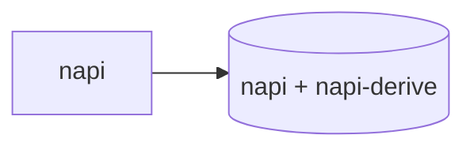

# Moon/Proto Tooling + Crate-Boundary Cleanup Implementation Plan

> **For agentic workers:** REQUIRED SUB-SKILL: Use superpowers:subagent-driven-development (recommended) or superpowers:executing-plans to implement this plan task-by-task. Steps use checkbox (`- [ ]`) syntax for tracking.

**Goal:** Adopt moonrepo's `proto`/`moon` for toolchain pinning and workspace-task orchestration
(matching the working precedent already in use at `~/Projects/oxc-react-codegen`), and remove the
`pipeline`/`fuzzy`/`cache`/`cli` Cargo features along with their now-unused dependencies and stub
files — since the crate-boundary decision made this session means that functionality comes back
as genuinely separate crates when it's actually built, never again as features on `michi` itself.

**Architecture:** No physical file relocation — `michi`'s root crate and `packages/michi-node`
stay exactly where they are; moon just registers their existing paths. `napi`/`serde` stay
features on the core crate (low dependency-unification risk, already reasoned through and
recorded). `pipeline`/`fuzzy`/`cache`/`cli` are removed outright, not relocated — there is no
code behind them today (the stub files are one-line comments), and pre-creating empty crates for
them now would just move the same ambiguity up one level of granularity. They get created for
real, as their own crates, in the session that first writes real code for each one.

**Tech Stack:** `proto` (toolchain manager), `moon` (task orchestrator), existing `just`/`cargo`/
`pnpm` tooling unchanged underneath.

---

## Task 1: Add `.prototools`

**Files:**
- Create: `.prototools`

- [ ] **Step 1: Create the file**

```toml
node = "~26"
pnpm = "~10"
rust = "1.96.0"
moon = "2.3.3"

[plugins]
moon = "source:https://raw.githubusercontent.com/moonrepo/moon/master/proto-plugin.toml"

[settings]
auto-install = true
```

`rust = "1.96.0"` matches michi's own `rust-version` in `Cargo.toml` exactly — no drift between
what `rustup`/`proto` installs and what the crate declares as its MSRV. Node/pnpm/moon versions
match `~/Projects/oxc-react-codegen/.prototools` (verify that file's current content before
committing — this plan quotes it from earlier in this session's investigation, and `~` version
ranges mean the exact resolved patch may have moved since).

- [ ] **Step 2: Verify proto can actually resolve this**

If `proto` is installed locally, run: `proto install` (or `proto use` depending on the installed
proto version's exact command name — check `proto --help` if unsure) from the repo root, and
confirm it resolves without error. If `proto` isn't installed in this environment, skip live
verification and note that in the task's completion report — don't fabricate a passing result.

- [ ] **Step 3: Commit**

```bash
git add .prototools
git commit -m "chore: add .prototools for toolchain version pinning"
```

---

## Task 2: Add `.moon/workspace.yml`

**Files:**
- Create: `.moon/workspace.yml`

- [ ] **Step 1: Fetch moon's current workspace.yml schema to confirm exact syntax**

Before writing this file, fetch `https://moonrepo.dev/docs/config/workspace` (or the current
canonical docs URL if that's moved) to confirm the `projects`/`vcs`/`telemetry` keys below are
still current — moon's config schema is a real, evolving external tool, and this plan's draft
below is based on `~/Projects/oxc-react-codegen/.moon/workspace.yml`'s actual content as read
earlier this session, not independently re-verified against moon's latest docs. If anything below
doesn't match current moon syntax, use the current correct syntax and note the deviation in the
task's completion report.

- [ ] **Step 2: Create the file**

```yaml
$schema: "https://moonrepo.dev/schemas/workspace.json"

projects:
  core: "."
  napi: "packages/michi-node"

vcs:
  client: git
  defaultBranch: main
  sync: true
  hooks:
    pre-commit:
      - '. "$HOME/.cargo/env"'
      - "cargo fmt --all --check"
      - "cargo clippy --workspace --all-features -- -D warnings"
      - "typos"
      - "cargo deny check"

telemetry: false
```

`defaultBranch: main` (not `master`) — confirm against `git branch --show-current` before
committing; this repo's default branch is `main`. The pre-commit hook commands match this
project's own `just check`'s constituent steps (`fmt-check clippy deny typos` from the
`justfile`) rather than oxc-react-codegen's exact invocation, since michi's `clippy`/`deny`
recipes don't take the same flags (no `--exclude`/`--locked` — michi doesn't have an napi crate
that needs excluding from the same clippy pass the way oxc's setup does).

- [ ] **Step 3: Verify and commit**

If `moon` is installed, run `moon check` (or whatever moon's current config-validation command
is — check `moon --help`) to confirm the file parses. If moon isn't installed in this
environment, skip live verification and note that in the completion report.

```bash
git add .moon/workspace.yml
git commit -m "chore: add moon workspace config, registering core and napi projects"
```

---

## Task 3: Add `.moon/toolchain.yml`

**Files:**
- Create: `.moon/toolchain.yml`

- [ ] **Step 1: Fetch moon's current toolchain.yml schema**

This file's exact shape wasn't directly observed in this session's research (only
`workspace.yml` and a per-project `moon.yml` were read from oxc-react-codegen). Fetch
`https://moonrepo.dev/docs/config/toolchain` to get the current correct schema before writing
anything — do not guess at the YAML structure.

- [ ] **Step 2: Create the file**

Based on moon's documented schema (confirm exact keys against Step 1's fetch), declare the rust
and node toolchains this workspace uses, matching the versions in `.prototools`:

```yaml
$schema: "https://moonrepo.dev/schemas/toolchain.json"

rust:
  version: "1.96.0"

node:
  version: "26"
  packageManager: "pnpm"
  pnpm:
    version: "10"
```

Adjust key names/structure to match whatever Step 1's fetch actually shows if it differs from
this draft.

- [ ] **Step 3: Verify and commit**

Run `moon check` (or moon's current equivalent) if moon is installed; otherwise note that
verification was skipped.

```bash
git add .moon/toolchain.yml
git commit -m "chore: add moon toolchain config"
```

---

## Task 4: Add per-project `moon.yml` files

**Files:**
- Create: `moon.yml` (repo root, the `core` project)
- Create: `packages/michi-node/moon.yml` (the `napi` project)

- [ ] **Step 1: Create the root `moon.yml`**

```yaml
language: rust

tasks:
  build:
    command: just build
    inputs:
      - "src/**/*"
      - "Cargo.toml"
  test:
    command: just test-rust-all
    inputs:
      - "src/**/*"
      - "tests/**/*"
      - "Cargo.toml"
    deps:
      - build
  check:
    command: just check
    inputs:
      - "src/**/*"
      - "tests/**/*"
      - "Cargo.toml"
```

Moon orchestrates *when*/*in what order across projects* these run; `just` still owns *how* each
one actually runs — no task logic is duplicated between the two.

- [ ] **Step 2: Create `packages/michi-node/moon.yml`**

```yaml
language: typescript

tasks:
  build:
    command: cd .. && just build-node
    inputs:
      - "src/**/*"
      - "Cargo.toml"
      - "package.json"
  test:
    command: cd .. && just test-node
    inputs:
      - "src/**/*"
      - "__test__/**/*"
    deps:
      - build
```

- [ ] **Step 3: Verify and commit**

If moon is installed, run `moon run core:build`, `moon run napi:build` (or moon's current
equivalent invocation syntax) and confirm both succeed. If moon isn't installed, run the
underlying `just` commands directly (`just build`, `just build-node`) to confirm they still work
unchanged, and note that moon-specific verification was skipped.

```bash
git add moon.yml packages/michi-node/moon.yml
git commit -m "chore: add per-project moon.yml task definitions wrapping existing just recipes"
```

---

## Task 5: Delete the Plan 2 stub files and their module declarations

**Files:**
- Delete: `src/pipeline/executor.rs`
- Delete: `src/sink/mod.rs`
- Delete: `src/resilience/circuit.rs`
- Delete: `src/resilience/policy.rs`
- Modify: `src/pipeline/mod.rs`
- Modify: `src/resilience/mod.rs`
- Modify: `src/lib.rs`

- [ ] **Step 1: Remove `executor.rs` and its module declaration**

Delete `src/pipeline/executor.rs`.

In `src/pipeline/mod.rs`, find and delete:
```rust
/// Pipeline execution engine (requires the `pipeline` feature).
#[cfg(feature = "pipeline")]
pub mod executor;
```
(This is currently the first thing in the file — confirm exact current position before deleting,
since other work may have touched this file since this plan was written.)

- [ ] **Step 2: Remove `sink/mod.rs` entirely**

Delete `src/sink/mod.rs`. This module has no `#[cfg(...)]` guard today — it's unconditionally
compiled despite containing only a stub comment, so removing it is a clean deletion with no
feature-gate to also strip inside the file itself.

In `src/lib.rs`, find and delete:
```rust
/// Output sink abstractions (no-op placeholder; plan 2 adds real sinks).
pub mod sink;
```

- [ ] **Step 3: Remove `circuit.rs`/`policy.rs` and their module declarations**

Delete `src/resilience/circuit.rs` and `src/resilience/policy.rs`.

In `src/resilience/mod.rs`, find and delete:
```rust
/// Circuit breaker state machine (requires the `pipeline` feature).
#[cfg(feature = "pipeline")]
pub mod circuit;
/// Retry and back-off policy execution (requires the `pipeline` feature).
#[cfg(feature = "pipeline")]
pub mod policy;
```
(Currently the first six lines of the file — confirm exact current position before deleting.)

- [ ] **Step 4: Verify nothing broke**

Run: `cargo build -p michi && cargo build -p michi --all-features`
Expected: clean — no dangling references to the deleted modules. (Task 6 removes the `pipeline`
feature from `Cargo.toml` itself; do this verification first, before Task 6, so any breakage is
attributable specifically to the module-declaration removal, not conflated with the feature
removal.)

Run: `cargo nextest run -p michi --all-features`
Expected: all existing tests still pass — nothing in `pipeline::tests`/`resilience::tests`
referenced the deleted modules (they were empty stubs with no tests of their own).

- [ ] **Step 5: Commit**

```bash
git add src/pipeline/executor.rs src/pipeline/mod.rs src/sink/mod.rs src/resilience/circuit.rs src/resilience/policy.rs src/resilience/mod.rs src/lib.rs
git commit -m "refactor: remove Plan 2 stub files and their module declarations

pipeline/fuzzy/cache/cli come back as genuinely separate crates when they're
actually built, never again as features/stub-modules on the core crate — see
docs/spec/06-decisions.md's crate-boundary entry."
```

(Note: `git add` on deleted files stages the deletion; this is correct usage, not an error.)

---

## Task 6: Remove the `pipeline`/`fuzzy`/`cache`/`cli` Cargo features and their now-unused dependencies

**Files:**
- Modify: `Cargo.toml`

Must run after Task 5 — these dependencies have no code referencing them once the stub files are
gone.

- [ ] **Step 1: Update `[features]`**

Find:
```toml
[features]
default  = []
pipeline = ["dep:tokio", "dep:tokio-util", "dep:async-trait", "dep:uuid"]
fuzzy    = ["dep:nucleo-matcher", "pipeline"]
cache    = ["dep:moka", "dep:sha2", "pipeline"]
cli      = ["dep:indicatif", "dep:inquire", "dep:crossterm", "dep:ctrlc", "pipeline"]
napi     = ["dep:napi", "dep:napi-derive", "dep:serde_json"]
serde    = ["dep:serde", "dep:serde_json"]
full     = ["pipeline", "fuzzy", "cache", "cli", "serde"]
```
Replace with:
```toml
[features]
default = []
napi    = ["dep:napi", "dep:napi-derive", "dep:serde_json"]
serde   = ["dep:serde", "dep:serde_json"]
```

`full` is removed, not redefined — its entire purpose was aggregating the now-removed heavy
features for test/bench harnesses; with only `serde` left, `full` and `serde` would be identical,
which isn't a real alias worth keeping. If any CI config or doc references `--features full`,
Task 8/9 catches and fixes those.

- [ ] **Step 2: Remove the now-unused dependencies**

Find:
```toml
[dependencies]
thiserror.workspace = true

# pipeline feature
tokio        = { version = "1", features = ["rt", "rt-multi-thread", "macros", "time", "sync"], optional = true }
tokio-util   = { version = "0.7", features = ["rt"], optional = true }
async-trait  = { version = "0.1", optional = true }
uuid         = { version = "1", features = ["v4"], optional = true }

# fuzzy feature
nucleo-matcher = { version = "0.3", optional = true }

# cache feature
moka = { version = "0.12", features = ["future"], optional = true }
sha2 = { version = "0.10", optional = true }

# cli feature
indicatif = { version = "0.17", optional = true }
inquire   = { version = "0.7", optional = true }
crossterm = { version = "0.27", optional = true }
ctrlc     = { version = "3", optional = true }

# napi feature
napi        = { version = "3", features = ["napi6", "serde-json"], optional = true }
napi-derive = { version = "3", optional = true }
serde_json  = { version = "1", optional = true, features = ["preserve_order"] }

# serde feature
serde      = { version = "1", features = ["derive"], optional = true }
```
Replace with:
```toml
[dependencies]
thiserror.workspace = true

# napi feature
napi        = { version = "3", features = ["napi6", "serde-json"], optional = true }
napi-derive = { version = "3", optional = true }
serde_json  = { version = "1", optional = true, features = ["preserve_order"] }

# serde feature
serde      = { version = "1", features = ["derive"], optional = true }
```

- [ ] **Step 3: Verify**

Run: `cargo build -p michi && cargo build -p michi --features serde && cargo build -p michi --features napi && cargo build -p michi --all-features`
Expected: all clean.

Run: `cargo nextest run -p michi --all-features && cargo clippy -p michi --all-features -- -D warnings && cargo fmt -p michi -- --check`
Expected: all clean. `Cargo.lock` will regenerate automatically, dropping the removed
dependencies — this is expected, not an error to fix.

Run: `cargo tree -p michi --all-features | grep -i "tokio\|moka\|nucleo\|indicatif\|inquire\|crossterm\|ctrlc"`
Expected: no output — confirms these are genuinely gone from the dependency tree, not just
hidden behind an unused feature flag.

- [ ] **Step 4: Commit**

```bash
git add Cargo.toml Cargo.lock
git commit -m "chore: remove pipeline/fuzzy/cache/cli Cargo features and their now-unused dependencies"
```

---

## Task 7: Rewrite `ARCHITECTURE.md`'s feature-graph section

**Files:**
- Modify: `ARCHITECTURE.md`

The current "One crate, feature-gated" section's premise (michi as one crate with several
Cargo-feature-gated subsystems) is no longer accurate after Task 6 — it needs a real rewrite,
not a small edit.

- [ ] **Step 1: Read the current section and replace it**

Find the section starting `## One crate, feature-gated` through the paragraph ending "it never
touches tokio." (the mermaid diagram plus its explanatory paragraph). Replace the whole section
with:

```markdown
## One crate today, more crates as Plan 2 gets built

`michi` today is one crate (plus the `packages/michi-node` NAPI shim, split out only because
`crate-type = ["cdylib"]` can't coexist with a regular `[lib]` in the same `Cargo.toml`). Default
features get pure rendering and nothing else — no async runtime, no cache, no CLI deps. `napi`
and `serde` are the only two optional features, and both stay features rather than becoming their
own crates: `serde`'s derives are low-consequence even if Cargo's feature-unification pulls them
into a build that didn't ask for them (most Rust consumers already have `serde` somewhere), and
`napi` requires napi-rs's cdylib build model, which doesn't practically leak into a normal Rust
binary's dependency graph the way an async runtime would.



**Plan 2 (`pipeline`/`fuzzy`/`cache`/`cli`) does not exist as code or as Cargo features today.**
It was removed from this crate's feature graph deliberately — see
[`docs/spec/06-decisions.md`](docs/spec/06-decisions.md)'s crate-boundary entry for the full
reasoning. The short version: those pieces pull in dependencies heavy and opinionated enough
(tokio, moka, nucleo-matcher, a terminal stack) that Cargo's feature-unification model would risk
surprising a consumer of the zero-dep default build who never asked for them — a risk that a
Cargo *feature* on this crate can't fully close, but a separate *crate* can, since a binary that
doesn't depend on that crate never pulls its dependencies in at all, regardless of what anything
else in its graph does. When each piece is actually built, it lands as its own crate depending on
`michi`, not a feature flag on `michi` itself — `pipeline` first (the others each depend on it),
`resilience`'s async circuit-breaker/retry-wrapper folded into that same crate rather than split
further (they have no use case independent of wrapping pipeline step execution), then `fuzzy`,
`cache`, and `cli` each as their own crate once their turn comes.
```

- [ ] **Step 2: Verify and commit**

Run: `grep -n "One crate, feature-gated\|fuzzy --> pipeline\|cache --> pipeline\|cli --> pipeline" ARCHITECTURE.md`
Expected: no output — old section fully replaced.

```bash
git add ARCHITECTURE.md
git commit -m "docs(architecture): rewrite the feature-graph section now that Plan 2 is crates, not features"
```

---

## Task 8: Update `docs/spec/01-overview-and-setup.md` and `docs/spec/05-scope-and-quality.md`

**Files:**
- Modify: `docs/spec/01-overview-and-setup.md`
- Modify: `docs/spec/05-scope-and-quality.md`

- [ ] **Step 1: Update `01-overview-and-setup.md`'s Cargo.toml section**

Find the `[features]` code block (currently showing `pipeline`/`serde`/`cli` — verify exact
current content first, since this doc's Cargo.toml block should already be close to accurate but
may have drifted) and replace it with the actual new `[features]` block from Task 6, Step 1.
Update the surrounding prose paragraph (the one explaining the Plan 2/`serde` distinction) to
reflect that `pipeline`/`fuzzy`/`cache`/`cli` are no longer Cargo features of this crate at all —
point to `ARCHITECTURE.md`'s rewritten section (Task 7) and `docs/spec/06-decisions.md`'s
crate-boundary entry (Task 10) rather than describing them as a feature set that exists on this
crate.

- [ ] **Step 2: Update `05-scope-and-quality.md`'s Feature flags section**

Find:
```toml
[features]
default = []
napi  = ["dep:napi", "dep:napi-derive", "dep:serde_json"]
serde = ["dep:serde", "dep:serde_json"]
cli   = ["dep:indicatif", "dep:inquire", "dep:crossterm", "dep:ctrlc"]  # reserved: terminal-width-aware rendering (colours, wrap)
```
(Confirm exact current content — this plan's recollection of this section may not be byte-exact.)
Replace with:
```toml
[features]
default = []
napi  = ["dep:napi", "dep:napi-derive", "dep:serde_json"]
serde = ["dep:serde", "dep:serde_json"]
```
Remove any surrounding prose describing `cli` as "reserved" on this crate — `cli` is no longer a
feature of `michi` at all; it becomes its own crate when built. Point readers to
`ARCHITECTURE.md` and `06-decisions.md` for where that work will actually land.

- [ ] **Step 3: Verify and commit**

Run: `grep -n "pipeline\|fuzzy\|cache.*feature\|cli.*reserved" docs/spec/01-overview-and-setup.md docs/spec/05-scope-and-quality.md`
Expected: no remaining references describing these as features of the current crate (mentions of
them as *future separate crates* are fine and expected).

```bash
git add docs/spec/01-overview-and-setup.md docs/spec/05-scope-and-quality.md
git commit -m "docs(spec): reflect the removed pipeline/fuzzy/cache/cli Cargo features"
```

---

## Task 9: Update `README.md` and `CLAUDE.md`

**Files:**
- Modify: `README.md`
- Modify: `CLAUDE.md`

- [ ] **Step 1: Update `README.md`'s Feature flags table**

Find the Feature flags table (currently listing `pipeline`/`fuzzy`/`cache`/`cli`/`full` rows —
confirm exact current content) and replace it with just the two real features:
```markdown
| Feature | Adds | Why you'd enable it |
|---|---|---|
| `napi` | napi, napi-derive, serde_json | building the NAPI/npm boundary |
| `serde` | serde, serde_json | `Serialize`/`Deserialize` on the core value types, `toon::list()` |
```
Update the surrounding prose if it references `full` or describes `pipeline`/`fuzzy`/`cache`/
`cli` as features of this crate.

- [ ] **Step 2: Update `CLAUDE.md`'s Architecture section**

Find:
```
- Feature flags: `pipeline` (tokio), `fuzzy`, `cache`, `cli`, `napi`, `serde` (opt-in Serialize/Deserialize + `toon::list()`)
```
Replace with:
```
- Feature flags: `napi`, `serde` (opt-in Serialize/Deserialize + `toon::list()`). Plan 2
  (`pipeline`/`fuzzy`/`cache`/`cli`) lands as separate crates when built, never as features here
  — see `ARCHITECTURE.md`.
```

- [ ] **Step 3: Verify and commit**

Run: `grep -n "pipeline\|fuzzy\|cache\|full" README.md CLAUDE.md`
Expected: no remaining references to these as current-crate features (module-table rows for
already-real modules like `pipeline`'s data type, if any remain accurate, are fine — check
context on any hit before treating it as something to fix).

```bash
git add README.md CLAUDE.md
git commit -m "docs: reflect the removed pipeline/fuzzy/cache/cli Cargo features in README and CLAUDE.md"
```

---

## Task 10: Record the crate-boundary decision rule in `docs/spec/06-decisions.md`

**Files:**
- Modify: `docs/spec/06-decisions.md`

- [ ] **Step 1: Add the entry**

In the "Why the API is shaped the way it is" section, add (position: after the existing
`Audience` relocation entry, before the `---` preceding "## Implementation notes" — verify exact
current file structure before inserting):

```markdown

**A separate crate is justified by dependency weight and coupling, not just "this is a distinct
feature."** The decision rule, for this crate and future ones like it: split into a separate
crate when (1) it pulls in dependencies heavy/opinionated enough that Cargo's feature-unification
model would genuinely surprise a consumer of the default build who never asked for them — the
strongest signal here, since michi's entire identity is "zero-dep by default" in a way most
crates don't promise as centrally; (2) it has low coupling to the core crate's internals, reaching
it only through the public API; (3) it would benefit from an independent release cadence rather
than forcing version bumps on the stable core. A dependency stays a *feature*, not a crate, when
it's low-consequence even if unified in accidentally (`serde`'s derives — most Rust consumers
already have `serde` somewhere) or would just create combinatorial Cargo.toml complexity with no
real benefit.

Applied to Plan 2: `pipeline` (the executor) becomes its own crate — heavy dependency (tokio),
clean boundary (operates only on the already-public `Pipeline` data type), independent maturity.
The async halves of `resilience` (`CircuitBreaker`, the retry wrapper) fold *into* that same
crate rather than becoming a fourth crate of their own — they exist specifically to wrap pipeline
step execution and have no independent use case, so criterion (2) fails for splitting them out
further. `fuzzy` and `cache` each become their own crate, downstream of `pipeline` (already true
today: `Resolution<T>` is used in pipeline context, so `fuzzy` implies `pipeline` by design).
`cli` becomes its own crate too — a genuinely different kind of consumer (a terminal, not an
agent) with no coupling to pipeline internals beyond calling into it like any other dependent
would.

None of this is scaffolded ahead of time. A crate gets created in the same work that writes its
first real implementation, not before — an empty crate sitting in the workspace is the identical
ambiguity problem the deleted `pipeline`/`sink`/`resilience` stub files caused, just moved up one
level of granularity.
```

- [ ] **Step 2: Verify and commit**

Run: `grep -n "separate crate is justified" docs/spec/06-decisions.md`
Expected: present.

```bash
git add docs/spec/06-decisions.md
git commit -m "docs(spec): record the crate-boundary decision rule and its application to Plan 2"
```

---

## Final verification

- [ ] Full build/test matrix:
  ```bash
  cargo build -p michi
  cargo build -p michi --features serde
  cargo build -p michi --features napi
  cargo build -p michi --all-features
  cargo nextest run -p michi --all-features
  cargo clippy -p michi --all-features -- -D warnings
  cargo fmt -p michi -- --check
  ```
  Expected: all clean.
- [ ] `cargo tree -p michi --all-features | grep -i "tokio\|moka\|nucleo\|indicatif\|inquire\|crossterm\|ctrlc"` — expect no output.
- [ ] `cd packages/michi-node && pnpm build --platform && pnpm test` — confirm the NAPI boundary is unaffected by any of this.
- [ ] `cargo publish --dry-run -p michi --allow-dirty` — confirm the crate still packages cleanly with the reduced dependency set.
- [ ] Grep the whole doc set for any remaining stale references: `grep -rln "pipeline.*feature\|fuzzy.*feature\|cache.*feature\|cli.*feature" docs/ README.md CLAUDE.md ARCHITECTURE.md 2>/dev/null` — eyeball any hits; expect none describing these as *current* features of `michi` (references describing them as *future separate crates* are correct and expected).
- [ ] If `moon`/`proto` are installed in this environment, run `moon run core:check`, `moon run core:test`, `moon run napi:build`, `moon run napi:test` (or their current-syntax equivalents) end to end. If neither tool is installed, note explicitly in the final report that moon/proto-specific verification was skipped and only the underlying `just`/`cargo`/`pnpm` commands were confirmed — don't claim moon verification succeeded without actually running it.
